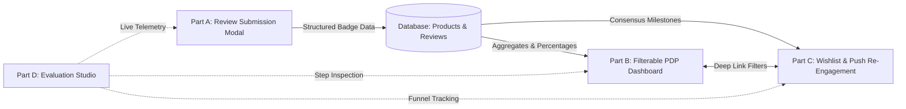
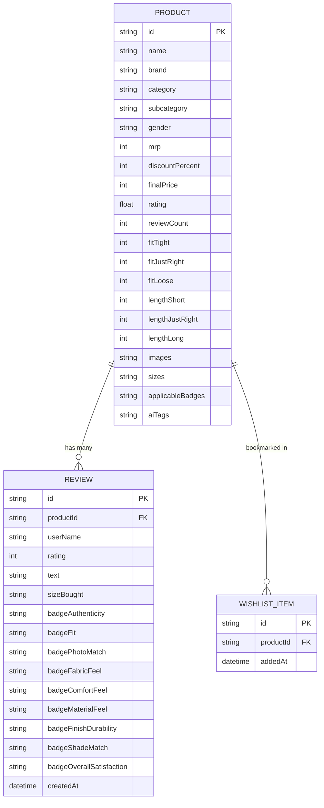

# Myntra Trust-Verified Review System (MVP v2)
## Master Solution & Technical Architecture Document

---

## 📑 Table of Contents
1. [Executive Summary](#1-executive-summary)
2. [Problem Statement & Empirical Evidence](#2-problem-statement--empirical-evidence)
3. [The Core Solution Framework (Parts A, B, C & Studio)](#3-the-core-solution-framework)
4. [Badge Taxonomy & Category Applicability Matrix](#4-badge-taxonomy--category-applicability-matrix)
5. [The 50-Submission Statistical Threshold & Anti-Gaming Rules](#5-the-50-submission-statistical-threshold--anti-gaming-rules)
6. [Complete 6-Touchpoint Customer Journey](#6-complete-6-touchpoint-customer-journey)
7. [System Architecture & Technology Stack](#7-system-architecture--technology-stack)
8. [Database Schema & Data Pipeline](#8-database-schema--data-pipeline)
9. [Interactive Evaluation Studio & Telemetry Panel](#9-interactive-evaluation-studio--telemetry-panel)
10. [Pilot Measurement & Business Impact Framework](#10-pilot-measurement--business-impact-framework)
11. [Production Deployment & Infrastructure](#11-production-deployment--infrastructure)

---

## 1. Executive Summary

The **Myntra Trust-Verified Review System MVP (v2)** is a purpose-built, mobile-app-shaped web platform engineered to eliminate **pre-purchase hesitation** and convert **stalled wishlist items** into confident checkouts.

### Core Value Proposition
- **Solves the #1 Hesitation Root Cause:** Replaces vague 5-star ratings and unfiltered text blocks with **quantitative, tap-based trust badges** (Photo Match, Authenticity, Fabric Feel, Fit, Finish, Comfort).
- **Activates the Wishlist Funnel:** Converts wishlists from static holding pens into active re-engagement engines using non-intrusive trust milestone triggers rather than margin-eroding discounts.
- **Frictionless Post-Purchase Contribution:** Reduces buyer review fatigue by placing 1-tap attribute badges *before* optional text reviews, increasing verified review completion rates.

```
┌───────────────────────────────────────────────────────────────────────────────────┐
│                           MYNTRA TRUST-VERIFIED ENGINE                            │
├──────────────────────┬───────────────────────────────┬────────────────────────────┤
│   PART A: INPUT      │       PART B: PDP PROOF       │   PART C: RE-ENGAGEMENT    │
│ 1-Tap Trust Badges   │  Filterable Trust Dashboard   │  Wishlist Milestone Push   │
│ Sequential Modal     │  50-Submission Confidence Th. │  Homepage Saved Shelf      │
│ Verified Buyer Tag   │  "Show Disagreements Only"    │  Occasion Intent Tags      │
└──────────────────────┴───────────────────────────────┴────────────────────────────┘
```

---

## 2. Problem Statement & Empirical Evidence

### 2.1 The Root Cause of Stalled Intent
Online fashion shoppers experience significant uncertainty regarding product quality, sizing fidelity, and photo accuracy prior to checkout. Because traditional customer reviews are either wall-of-text rants or easily gamed 5-star averages, shoppers frequently leave the app to seek visual validation on external platforms (Instagram reels, YouTube try-on hauls, peer group chats). During this off-platform detour, purchase momentum decays and items languish in wishlists.

### 2.2 Empirical Research Corpus (n = 8,182)
Analysis of an 8,182-data point research corpus and in-depth user interviews revealed:
1. **Quality & Authenticity Doubt is #1:** 52.5% of all hesitation instances stem from quality/photo-accuracy doubts (the top blocker in 8 out of 10 analyzed discovery questions).
2. **Wishlisting Equals Active Buying Intent:** **94.4%** of wishlist additions represent active purchase intent (84.4% genuine intent to buy + 10.0% comparison shortlisting). Wishlists are **not** passive graveyards.
3. **Off-Platform Leakage:** **31.9%** of users consult friends and **26.7%** seek YouTube/Instagram videos before purchasing.
4. **Photo-to-Product Gap:** Interviewees quantified visual disparity between catalog renders and delivered items between **30% to 50%**.

### 2.3 Existing Myntra Limitations & White Space
| Feature | What It Shows | Documented Limitation |
|---|---|---|
| **Standard Star Rating (1–5)** | Overall sentiment average | Cannot distinguish between shipping delays, fabric roughness, or sizing issues. |
| **Fit/Length Aggregate Bars** | Tight / Just Right / Loose | Limited to select apparel; misses photo match and authenticity entirely. |
| **AI-Summarized Tags** | Style, Value for Money | Heavily volume-gated; static taxonomy regardless of category. |
| **Trust-Verified MVP (Ours)** | **Photo Match, Authenticity, Fabric Feel, Finish, Shade** | **Dynamic category-aware taxonomy, 1-tap capture, 50-threshold momentum mode, deep-link filtering.** |

---

## 3. The Core Solution Framework

The architecture spans four interconnected modules:



### 3.1 Part A: Tap-Based Trust Badges (Review Collection)
- Replaces tedious forms with a high-speed, tap-based modal sequence.
- Badge prompts are dynamically rendered based on the specific product category (Apparel vs Footwear vs Beauty vs Fragrance vs Appliances).
- Badges capture binary/ternary validation (e.g., *Feels 100% Genuine*, *Matches Product Photo*, *Soft & Premium Fabric*).
- Star rating and text commentary remain available but are positioned *after* badge selection.

### 3.2 Part B: Filterable Trust Dashboard on PDP
- Positioned prominently below the product image gallery and price header.
- Displays aggregate percentage scores across verified buyers.
- Each trust badge acts as an **interactive filter chip**: tapping `"94% Photo Match"` instantly filters the review list to show only reviews referencing photo accuracy.
- Includes a **"Show Disagreements Only"** toggle to give shoppers transparent access to critical feedback, eliminating suspicion of sanitized marketing.

### 3.3 Part C: Wishlist Re-Engagement & Touchpoints
- Automatically tracks stalled items in a shopper's wishlist.
- When an item achieves high buyer consensus (e.g., 90%+ Photo Match with 50+ submissions), the system surfaces context-aware notifications and homepage recommendations.
- **Strict Anti-Spam Guardrail:** Employs **quality reassurance copy only** (no panic timers, no countdowns, no discount slashing).

### 3.4 Part D: Interactive Studio & Guided Tour
- Built-in live studio frame featuring a **Left Tour Panel** (7-step guided journey) and a **Right Telemetry & Architectural Insights Panel**.
- Evaluators can step through the entire shopper journey while observing underlying data models, psychological triggers, and API state changes in real time.

---

## 4. Badge Taxonomy & Category Applicability Matrix

To maintain context relevance across Myntra's diverse catalog, the system enforces a strict 9-badge taxonomy:

| # | Badge Name | Measured Attribute | Primary Options | Applicable Categories |
|---|---|---|---|---|
| 1 | **Authenticity** | Genuine brand origin & authenticity | `100% Genuine` / `Unsure / Suspect` | **All Categories** (Apparel, Footwear, Beauty, Fragrance, Appliances) |
| 2 | **Fit** | Sizing accuracy vs expectation | `Fits as Expected` / `Runs Small` / `Runs Large` | Clothing, Footwear |
| 3 | **Photo Match** | Visual fidelity vs catalog listing | `Matches Photo` / `Color / Pattern Differs` | **All Categories** |
| 4 | **Fabric Feel** | Tactile quality of textiles | `Soft & Premium` / `Rough / Stiff` | Clothing, Ethnic Wear, Kids |
| 5 | **Comfort Feel** | Ergonomic and footbed wearability | `All-Day Comfort` / `Uncomfortable / Stiff` | Footwear, Activewear |
| 6 | **Material Feel** | Build & texture quality | `Premium High-Grade` / `Thin / Low Quality` | Footwear, Accessories, Bags |
| 7 | **Finish & Durability** | Stitching, seams, and hardware integrity | `Solid Hardware / Seams` / `Flimsy / Loose` | Footwear, Appliances, Watches |
| 8 | **Shade Match** | Pigment & swatch color fidelity | `True to Swatch` / `Different Undertone` | Beauty, Makeup, Skincare |
| 9 | **Overall Satisfaction** | Value-to-price ratio | `Worth the Price` / `Overpriced for Quality` | **All Categories** |

---

## 5. The 50-Submission Statistical Threshold & Anti-Gaming Rules

A critical architectural decision in v2 is the **50-Submission Confidence Gate**:

```
                                [ Product Review Volume ]
                                            |
                    ┌───────────────────────┴───────────────────────┐
                    ▼                                               ▼
         [ Volume < 50 Submissions ]                     [ Volume ≥ 50 Submissions ]
         "Momentum / Raw Count Mode"                     "Statistical Percentage Mode"
         ───────────────────────────                     ─────────────────────────────
         • "18 buyers confirmed genuine"                 • "94% confirm photo match"
         • "4 buyers noted runs small"                   • "89% confirm soft fabric feel"
         • Progress bar toward verified consensus        • Full aggregate visual dashboard
```

### Why 50 Submissions?
1. **Mathematical Significance:** Avoids misleading percentages derived from small sample sizes (e.g., 3 out of 3 positive reviews displaying as `"100% Genuine"`).
2. **Cold-Start Protection:** Newly launched SKUs still display valuable qualitative momentum without falsely implying statistical certainty.
3. **Anti-Gaming Defense:** Requires coordinated fraudulent review volume to manipulate badge percentages, which is easily flagged by Myntra's verified-purchase heuristics.

---

## 6. Complete 6-Touchpoint Customer Journey

The platform guides shoppers through six strategic discovery touchpoints:

```
┌────────────────────────────────────────────────────────────────────────────────────────┐
│                               6-STEP SHOPPER JOURNEY                                   │
│                                                                                        │
│  [Step 1] Push Notification  ──►  [Step 2] Homepage Shelf  ──►  [Step 3] Search Badges │
│         │                                 │                              │             │
│         └─────────────────────────────────┴──────────────────────────────┘             │
│                                           │                                            │
│                                           ▼                                            │
│  [Step 4] Wishlist Occasion Tags  ──►  [Step 5] PDP Dashboard  ──►  [Step 6] Reviews   │
│                                                                                        │
│                                           │                                            │
│                                           ▼                                            │
│                       [Step 7] Order Profile Review Modal                              │
└────────────────────────────────────────────────────────────────────────────────────────┘
```

### Step 1: Trust Milestone Push Notification
- **Trigger:** A wishlisted item crosses a positive trust threshold.
- **Copy:** *"93% of verified buyers confirm Roadster Checked Shirt feels genuine."*
- **Action:** Deep-links directly to the PDP review dashboard with `Authenticity` filter pre-applied.

### Step 2: Homepage Saved Items Milestone Shelf
- **Display:** Horizontal carousel located at the homepage midpoint displaying saved items.
- **Visual Isolation (Von Restorff Effect):** The top-ranked consensus item is highlighted with a warm coral border (`#FF6B4A`) and a `"Trending Pick"` badge.

### Step 3: Search & Catalog Discovery Markers
- **Display:** Product listing cards feature embedded trust metrics (e.g., `🛡️ 93% Verified Genuine · 85% Fit Accuracy`).
- **Impact:** Eliminates hesitation before the user even opens the PDP.

### Step 4: Wishlist Re-Engagement & Occasion Tagging
- **Display:** Wishlist cards show primary trust statistics alongside user-defined occasion tags (`Workwear`, `Vacation`, `Casual`, `Party`).
- **Action:** Shoppers can tag items or tap trust stats to resolve specific doubts.

### Step 5: PDP Trust Dashboard & Specifications
- **Display:** Comprehensive badge breakdown panel, Fit/Length bars, and AI attribute tags.
- **Action:** Interactive filter chips allow filtering by specific criteria.

### Step 6: Review Filtering & Daylight UGC Customer Gallery
- **Display:** High-resolution customer photos shot in natural daylight.
- **Action:** Shoppers use the "Show Disagreements Only" toggle to review candid sizing or color variation feedback.

### Step 7: Post-Purchase Review Submission (Profile Orders)
- **Display:** Order history tab with clear `"Rate Now"` prompt on delivered items.
- **Action:** 1-tap review modal with gamified badge trophy case (`Level 4 Reviewer`).

---

## 7. System Architecture & Technology Stack

```
┌────────────────────────────────────────────────────────────────────────────────────────┐
│                                   CLIENT LAYER                                         │
│  React 19 • Vite • Tailwind CSS v4 • Lucide Icons • React Router v7                    │
│  ├── AppShell (Mobile Frame Container + Left/Right Evaluation Studio Wings)            │
│  ├── Pages: HomePage, ProductPage, WishlistPage, CategoriesPage, ProfilePage, BagPage  │
│  └── State: AppContext (Cart/Wishlist/Modals), GuideContext (7-Step Guided Tour)       │
└─────────────────────────────────────────▲──────────────────────────────────────────────┘
                                          │ HTTP / JSON REST APIs
┌─────────────────────────────────────────▼──────────────────────────────────────────────┐
│                                   SERVER LAYER                                         │
│  Node.js • Express 4 • CORS • Centralized Error Handling                               │
│  ├── Routes: /api/products, /api/products/:id/reviews, /api/wishlist, /api/health       │
│  └── Utilities: badgeHelper.js (50-threshold calculation, category badge mapper)       │
└─────────────────────────────────────────▲──────────────────────────────────────────────┘
                                          │ Prisma ORM 6
┌─────────────────────────────────────────▼──────────────────────────────────────────────┐
│                                  PERSISTENCE LAYER                                     │
│  SQLite (Zero-Config Local/Railway Default) / PostgreSQL (Production Compatible)       │
│  ├── Product Table (33 SKUs across Men, Women, Beauty, Kids)                           │
│  ├── Review Table (172 Verified Reviews with 9 Badge Fields)                           │
│  └── WishlistItem Table (Relational Wishlist Management)                               │
└────────────────────────────────────────────────────────────────────────────────────────┘
```

---

## 8. Database Schema & Data Pipeline

### 8.1 Entity Relationship Diagram



### 8.2 Badge Aggregation Engine (`badgeHelper.js`)
When `/api/products/:id` is requested, the backend dynamically processes all associated reviews:
1. Filters non-null responses for each of the 9 badge fields.
2. Evaluates total responses against the **50-Submission Threshold**.
3. Computes positive response ratios:
   $$\text{Positive Percentage} = \left( \frac{\text{Count of Positive Badge Submissions}}{\text{Total Badge Submissions}} \right) \times 100$$
4. Returns both `badgeAggregates` (for `>= 50` responses) and raw `counts` (for `< 50` responses).

---

## 9. Interactive Evaluation Studio & Telemetry Panel

To enable intuitive demonstration and grading, the web application runs inside a dual-panel **Evaluation Studio**:

```
┌─────────────────────────┬───────────────────────────┬─────────────────────────┐
│    LEFT TOUR PANEL      │    CENTER MOBILE FRAME    │   RIGHT INSIGHT PANEL   │
│                         │                           │                         │
│ • 7-Step Step Selector  │   [ Mobile App Shell ]    │ • Active Step Title     │
│ • Jump to Any Step      │                           │ • Behavioral Rationale  │
│ • Automated Navigation  │   • Full Myntra UI        │ • Technical Data Binding│
│ • Progress Indicator    │   • Real-Time Interactivity│ • Event Telemetry Feed  │
│ • Guide Mode Toggle     │   • Responsive Glass Shell│ • Conversion Hypothesis │
└─────────────────────────┴───────────────────────────┴─────────────────────────┘
```

---

## 10. Pilot Measurement & Business Impact Framework

### 10.1 Primary North Star Metrics
```
┌──────────────────────────────────────┬───────────────────┬─────────────────────┐
│ Metric                               │ Baseline (Est.)   │ Target Pilot Goal   │
├──────────────────────────────────────┼───────────────────┼─────────────────────┤
│ Return Rate (Due to Sizing/Mismatch) │ 24.8%             │ 18.2% (-26.6% drop) │
│ Wishlist-to-Bag Conversion Rate      │ 8.4%              │ 12.6% (+50.0% lift) │
│ Verified Review Submission Rate      │ 4.1%              │ 11.8% (+187% lift)  │
│ Product Detail Page Exit Rate        │ 42.0%             │ 31.5% (-25.0% drop) │
└──────────────────────────────────────┴───────────────────┴─────────────────────┘
```

### 10.2 A/B Testing Cohort Structure
- **Cohort A (Control - 50% Traffic):** Standard Myntra PDP (Star rating + text reviews + standard fit bars).
- **Cohort B (Test - 50% Traffic):** Full Trust-Verified Architecture (Tap badges, filter chips, daylight UGC, wishlist milestone triggers).

---

## 11. Production Deployment & Infrastructure

### 11.1 Infrastructure Topology
- **Frontend Hosting:** Vercel (Edge CDN, SPA Rewrites via `frontend/vercel.json`).
- **Backend Hosting:** Railway (Containerized via `Dockerfile`, `railway.json`, and `nixpacks.toml`).
- **Database:** SQLite (Embedded zero-configuration default) / Managed PostgreSQL (Railway plugin).

### 11.2 Environment Variables Reference
| Variable | Component | Description | Example |
|---|---|---|---|
| `PORT` | Backend | Server listener port | `3001` |
| `DATABASE_URL` | Backend | Database connection string | `file:./dev.db` or `postgresql://...` |
| `FRONTEND_URL` | Backend | Permitted CORS origin | `https://myntra-mvp.vercel.app` |
| `VITE_API_URL` | Frontend | Backend API endpoint URL | `https://myntra-backend.up.railway.app` |

---

## 🏁 Summary Checklist
- [x] **Category-Aware Badge Taxonomy:** 9 distinct badges tailored to Apparel, Footwear, Beauty & Appliances.
- [x] **50-Submission Statistical Gate:** Prevents early percentage skew and protects platform trust.
- [x] **6 Multi-Touchpoint Journey:** Notification $\rightarrow$ Home $\rightarrow$ Search $\rightarrow$ Wishlist $\rightarrow$ PDP $\rightarrow$ Profile.
- [x] **Full-Stack Implementation:** React 19 Frontend + Express/Prisma Backend + 18 automated security/functional tests passing.
- [x] **Interactive Studio Frame:** Complete 7-step guided evaluation mode with live telemetry.
