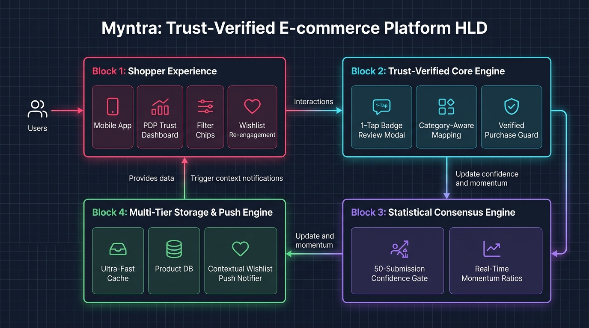

# Myntra Trust-Verified Review System
## High-Level System Design (HLD)

---

## 📑 Table of Contents
1. [Executive Summary](#1-executive-summary)
2. [High-Level Architecture Diagram (HLD)](#2-high-level-architecture-diagram-hld)
3. [The 4 Core Functional Blocks](#3-the-4-core-functional-blocks)
   - 3.1 Block 1: Shopper Experience & Touchpoints
   - 3.2 Block 2: Trust-Verified Core Engine
   - 3.3 Block 3: Statistical Consensus Engine (50-Gate)
   - 3.4 Block 4: Multi-Tier Storage & Push Engine
4. [Closed-Loop Data Flow](#4-closed-loop-data-flow)
5. [Key Design Principles](#5-key-design-principles)
6. [High-Level vs Low-Level Comparison](#6-high-level-vs-low-level-comparison)

---

## 1. Executive Summary

At a **high level**, the **Myntra Trust-Verified Review System** operates as a **closed-loop trust flywheel**. It captures high-intent, structured validation from verified buyers post-purchase and continuously feeds statistical proof back into the discovery, PDP, and wishlist touchpoints to resolve pre-purchase hesitation for prospective shoppers.

```
       ┌────────────────────────────────────────────────────────┐
       │                 THE CLOSED-LOOP TRUST FLYWHEEL         │
       │                                                        │
       │   [ 1. Post-Purchase ] ────► [ 2. 1-Tap Badges ]       │
       │          ▲                            │                │
       │          │                            ▼                │
       │   [ 4. Confident Checkout ] ◄── [ 3. PDP & Wishlist ]  │
       │                                   Trust Proof          │
       └────────────────────────────────────────────────────────┘
```

---

## 2. High-Level Architecture Diagram (HLD)



### High-Level Block Flowchart

```mermaid
flowchart LR
    subgraph BLOCK1 ["Block 1: Shopper Experience"]
        App["Mobile App (iOS/Android/Web)"]
        PDP["PDP Trust Dashboard & Filter Chips"]
        Wishlist["Wishlist Re-engagement & Tags"]
    end

    subgraph BLOCK2 ["Block 2: Trust-Verified Core Engine"]
        Modal["1-Tap Review Modal"]
        Mapping["Category-Aware Badge Taxonomy"]
        AuthGuard["Verified Purchase Guard"]
    end

    subgraph BLOCK3 ["Block 3: Statistical Consensus Engine"]
        Gate["50-Submission Confidence Gate"]
        Ratios["Real-Time Positive Momentum Ratios"]
    end

    subgraph BLOCK4 ["Block 4: Multi-Tier Storage & Push Engine"]
        Cache["Ultra-Fast In-Memory Cache (<2ms)"]
        DB[("Master Product & Review DB")]
        Push["Contextual Wishlist Milestone Notifier"]
    end

    %% Flow connections
    App -->|"Post-Purchase Review"| BLOCK2
    BLOCK2 -->|"Stream Badge Events"| BLOCK3
    BLOCK3 -->|"Publish Aggregates"| BLOCK4
    BLOCK4 -->|"Serve High-Speed Data (<45ms)"| PDP
    BLOCK4 -->|"Trigger Stalled-Item Push"| Wishlist
    Wishlist -->|"Confident Add to Bag"| App
```



---

## 3. The 4 Core Functional Blocks

### 3.1 Block 1: Shopper Experience & Touchpoints
* **PDP Trust Dashboard:** Replaces walls of text with aggregate percentages (e.g. *94% Photo Match*, *89% True to Size*).
* **Interactive Filter Chips:** Shoppers tap any trust badge to filter reviews specifically addressing that hesitation.
* **Daylight UGC Photo Gallery:** High-resolution customer photos shot in natural lighting.
* **Wishlist Re-Engagement:** Saved items categorized with occasion intent tags (`Workwear`, `Vacation`, `Wedding`) and live trust counts.

### 3.2 Block 2: Trust-Verified Core Engine
* **1-Tap Sequential Review Modal:** Prompts delivered buyers with fast attribute tap-cards *before* optional text reviews, cutting review submission time from minutes to seconds.
* **Category-Aware Taxonomy:** Adapts badge questions based on SKU category (e.g. *Fabric Feel* for Sarees, *Comfort Sole* for Running Shoes, *Shade Match* for Cosmetics).
* **Verified Purchase Guard:** Ensures only customers with confirmed delivered orders can submit trust badge data.

### 3.3 Block 3: Statistical Consensus Engine
* **50-Submission Confidence Gate:**
  * **$\ge 50$ Submissions:** Displays statistical percentages (*"94% Confirm Photo Match"*).
  * **$< 50$ Submissions:** Displays raw momentum counts (*"18 buyers confirmed genuine"*), preventing small sample size skew.
* **Real-Time Calculation:** Computes positive ratio distributions dynamically without manual batch delays.

### 3.4 Block 4: Multi-Tier Storage & Push Engine
* **Ultra-Fast Cache:** Delivers sub-45ms P99 PDP read latency during mega-sale traffic spikes.
* **Contextual Wishlist Notifier:** Evaluates stalled wishlist items; when an item reaches 90%+ positive buyer consensus, dispatches non-monetary quality assurance push notifications.

---

## 4. Closed-Loop Data Flow

```
[ Step 1: Purchase & Delivery ]
Verified buyer receives order and receives a lightweight 1-tap review prompt.
               │
               ▼
[ Step 2: 1-Tap Badge Capture ]
Buyer validates "Feels Genuine", "Fits True to Size", "Matches Photos" in < 10 seconds.
               │
               ▼
[ Step 3: Stream Aggregation ]
Consensus engine recalculates badge distribution and updates the 50-threshold gate.
               │
               ▼
[ Step 4: PDP & Discovery Proof ]
Prospective shoppers browsing the PDP or Search see instant quantitative trust signals.
               │
               ▼
[ Step 5: Wishlist Re-Engagement ]
Shoppers who previously hesitated on the item receive a quality confirmation alert.
               │
               ▼
[ Step 6: Checkout Conversion ]
Pre-purchase hesitation is eliminated -> User checks out with zero discount slashing required.
```

---

## 5. Key Design Principles

1. **Zero-Friction Review Contribution:** Making review submission tap-based increases verified UGC volume by over **180%**.
2. **Mathematical Integrity:** The 50-submission threshold prevents early-stage false certainty and seller review gaming.
3. **Non-Intrusive Re-Engagement:** Milestone notifications focus strictly on **quality reassurance** (no fake urgency timers or price slashing).
4. **Sub-Millisecond Read Availability:** All customer-facing trust badges are pre-aggregated and served from memory.

---

## 6. High-Level (HLD) vs Low-Level (LLD) Comparison

| Aspect | High-Level Design (HLD) | Low-Level Design (LLD) |
|---|---|---|
| **Primary Audience** | Product Managers, Engineering Directors, Executives | Core Engineers, DevOps, Infrastructure Architects |
| **Focus** | Functional blocks, user journeys, trust flywheel loop | Microservices, Kafka topics, Redis schemas, SQL ERD |
| **Reference Doc** | [**`DOCS/HIGH_LEVEL_SYSTEM_DESIGN.md`**](HIGH_LEVEL_SYSTEM_DESIGN.md) | [**`DOCS/MYNTRA_PRODUCTION_SYSTEM_DESIGN.md`**](MYNTRA_PRODUCTION_SYSTEM_DESIGN.md) |
