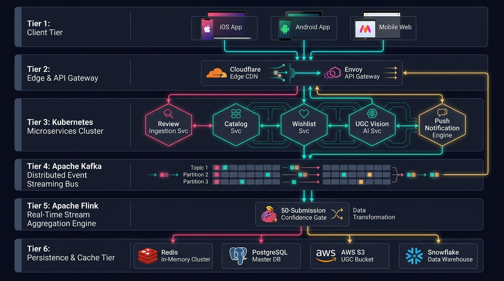
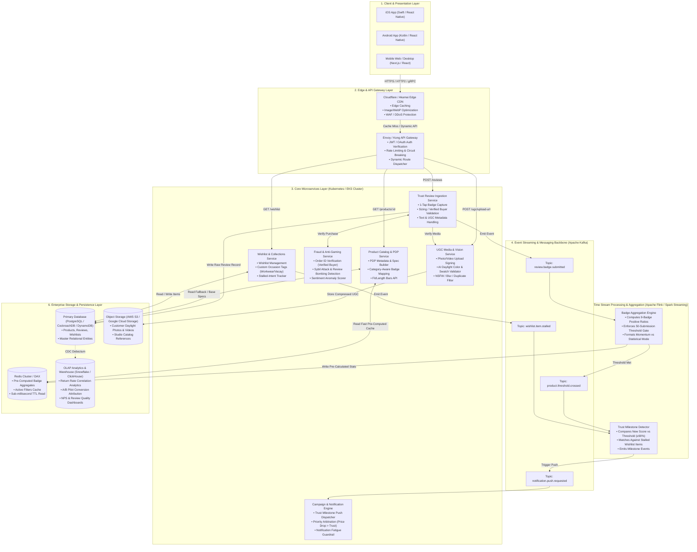
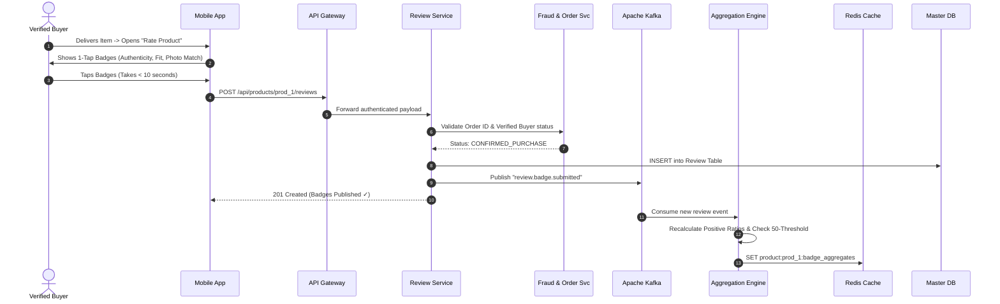
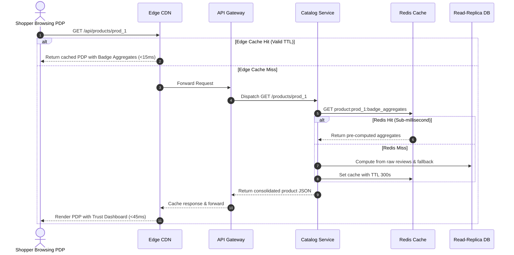
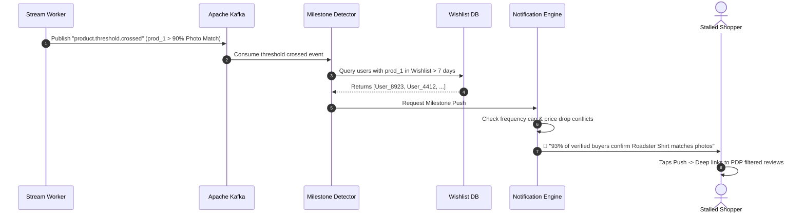
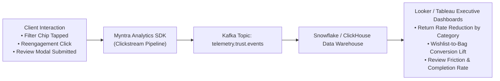

# Myntra Trust-Verified Review System
## Enterprise Production System Design & Architecture Specification

---

## 📑 Table of Contents
1. [Executive Overview & Scale Context](#1-executive-overview--scale-context)
2. [End-to-End Enterprise Architecture Diagram](#2-end-to-end-enterprise-architecture-diagram)
3. [Component Breakdown by Layer](#3-component-breakdown-by-layer)
   - 3.1 Client Layer (Native iOS/Android & mWeb)
   - 3.2 Edge & API Gateway Layer
   - 3.3 Core Microservices Layer
   - 3.4 Event Streaming & Async Message Bus (Kafka)
   - 3.5 Real-Time Aggregation & Worker Engine
   - 3.6 Persistence, Cache & Storage Layer
4. [Data Flow & Sequence Pipelines](#4-data-flow--sequence-pipelines)
   - 4.1 Pipeline A: Post-Purchase 1-Tap Review Submission
   - 4.2 Pipeline B: PDP High-Speed Badge Aggregates Serving
   - 4.3 Pipeline C: Async Stalled-Wishlist Milestone Notification
5. [Caching Strategy & Sub-Millisecond SLA](#5-caching-strategy--sub-millisecond-sla)
6. [Anti-Gaming, Fraud Detection & Moderation Engine](#6-anti-gaming-fraud-detection--moderation-engine)
7. [Analytics, Telemetry & A/B Experimentation Pipeline](#7-analytics-telemetry--ab-experimentation-pipeline)
8. [Reliability, Fault Tolerance & Disaster Recovery](#8-reliability-fault-tolerance--disaster-recovery)

---

## 1. Executive Overview & Scale Context

Implementing the **Trust-Verified Review System** at Myntra's production scale requires an architecture capable of supporting:
* **Traffic Scale:** 40M+ Monthly Active Users (MAU), 150M+ daily page views, and peak festive concurrency (>100,000 QPS on PDP).
* **Latency SLA:** P99 PDP response time `< 45ms` (badge aggregates cached in-memory at the edge).
* **Write Throughput:** Millions of post-purchase badge reviews collected during major shopping events (EORS / Big Fashion Festival).
* **Event-Driven Re-Engagement:** Real-time stream processing to identify stalled wishlist items reaching 50+ consensus thresholds without database table locks.

---

## 2. End-to-End Enterprise Architecture Diagram



### High-Level Topology Specification



---

## 3. Component Breakdown by Layer

### 3.1 Client Layer (Native iOS/Android & Mobile Web)
* **Mobile Apps (Kotlin / Swift / React Native):** Native rendering of the 1-tap review submission modal, daylight UGC carousel, and filter chips.
* **Optimistic Local State:** When a user taps a trust badge chip (e.g. `94% Photo Match`), client-side filtering executes instantly (< 16ms frame rate) while background API queries fetch extended pages.

### 3.2 Edge & API Gateway Layer
* **Edge CDN (Akamai / Cloudflare):** Terminates SSL, caches pre-calculated PDP trust badge JSON fragments with a 60-second TTL, and performs on-the-fly WebP image compression.
* **API Gateway (Envoy / Kong):** Enforces JWT user authentication, rate limiting (prevents review submission spam), and injects telemetry headers for A/B testing cohort routing.

### 3.3 Core Microservices Layer
1. **Trust Review Ingestion Service:**
   - Exposes `POST /api/products/:id/reviews`.
   - Validates that the reviewer purchased the product (`Verified Buyer`), checks size compatibility, and records binary/ternary badge choices.
2. **Product Catalog & PDP Service:**
   - Merges core catalog metadata (MRP, brand, images, sizes) with pre-computed badge aggregates fetched from Redis.
3. **Wishlist & Re-Engagement Service:**
   - Tracks item save timestamps, user-assigned occasion tags (`Workwear`, `Wedding`, `Casual`), and calculates wishlist dormancy duration.
4. **Campaign & Notification Engine:**
   - Interacts with Firebase Cloud Messaging (FCM) and Apple Push Notification Service (APNs).
   - **Anti-Spam Filter:** Ensures a user receives at most one trust notification every 4 days, prioritizing price drops over trust milestones when both co-occur.

---

## 4. Data Flow & Sequence Pipelines

### 4.1 Pipeline A: Post-Purchase 1-Tap Review Submission



---

### 4.2 Pipeline B: PDP High-Speed Badge Aggregates Serving



---

### 4.3 Pipeline C: Async Stalled-Wishlist Milestone Notification



---

## 5. Caching Strategy & Sub-Millisecond SLA

To handle mega-sale concurrency without degrading database performance:

```
┌──────────────────────────────────────────────────────────────────────────────┐
│                            MULTI-TIER CACHE HIERARCHY                        │
├──────────────────────────┬───────────────────┬───────────────────────────────┤
│ Tier                     │ Technology        │ Stored Data & Eviction Policy │
├──────────────────────────┼───────────────────┼───────────────────────────────┤
│ Tier 1: Client Cache     │ React Query / SWR │ 3-minute in-memory cache      │
│ Tier 2: Edge CDN         │ Akamai / Cloudflare│ 60-second TTL edge JSON fragment │
│ Tier 3: Distributed Cache│ Redis Cluster (v7)│ Key: `prod:{id}:trust_stats`  │
│ Tier 4: Primary DB       │ PostgreSQL Replica│ Read-replica fallback pool    │
└──────────────────────────┴───────────────────┴───────────────────────────────┘
```

### Redis Key Data Structure:
```json
{
  "key": "prod:prod_1:badge_aggregates",
  "ttl": 3600,
  "value": {
    "totalBadgeReviews": 54,
    "hasThreshold": true,
    "confidenceLevel": "HIGH",
    "badges": {
      "authenticity": { "positivePercent": 93, "sampleSize": 54, "headline": "Feels 100% Genuine" },
      "photoMatch": { "positivePercent": 91, "sampleSize": 54, "headline": "Matches Product Photo" },
      "fit": { "positivePercent": 85, "sampleSize": 52, "headline": "Fits as Expected" },
      "fabricFeel": { "positivePercent": 88, "sampleSize": 50, "headline": "Soft & Breathable Cotton" }
    }
  }
}
```

---

## 6. Anti-Gaming, Fraud Detection & Moderation Engine

To protect platform integrity against seller review manipulation and bot rings:

1. **Verified Buyer Token Requirement:** A review submission must include an immutable `order_item_id` signed by the Order Service. Non-buyers cannot submit badge data.
2. **Sybil & Velocity Throttling:** Detects abnormal spikes in positive badge submissions for a single merchant SKU within short time windows ($>3\sigma$ velocity anomaly).
3. **Computer Vision Daylight Verification:** UGC photos uploaded by buyers pass through a lightweight vision classifier ensuring:
   - Image contains clothing/textiles (filters out random irrelevant photos).
   - Natural color balance check (flags studio-rendered stock images uploaded maliciously).

---

## 7. Analytics, Telemetry & A/B Experimentation Pipeline



### Key Tracked Event Schemas:
* `trust_badge_viewed(productId, badgeType, percentValue, thresholdMode)`
* `trust_filter_clicked(productId, filterKey, disagreeOnly)`
* `wishlist_reengagement_clicked(productId, milestoneType)`
* `review_badge_submitted(productId, orderId, badgesSelectedCount, durationSeconds)`

---

## 8. Reliability, Fault Tolerance & Disaster Recovery

* **Graceful Degradation:** If the Redis aggregation cache becomes unavailable, the PDP automatically falls back to standard star rating and fit bars without blocking product page renders.
* **Circuit Breakers (Resilience4j / Envoy):** If the Trust Review service experiences latency $> 200\text{ms}$, review badge writes are queued asynchronously in Kafka while acknowledging the user with an optimistic success confirmation.
* **Multi-AZ Replication:** Redis Cluster and PostgreSQL instances span three AWS Availability Zones with automated sub-30-second failover.

---

## 🏁 Architectural Summary
This system design provides **horizontal scalability**, **sub-45ms PDP read latencies**, and **real-time event streaming**, seamlessly integrating trust-verified validation directly into Myntra's high-scale production ecosystem.
