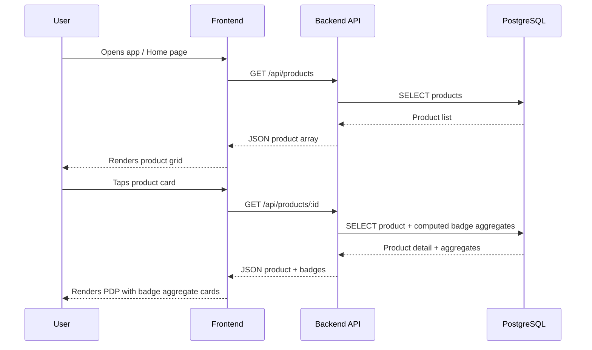
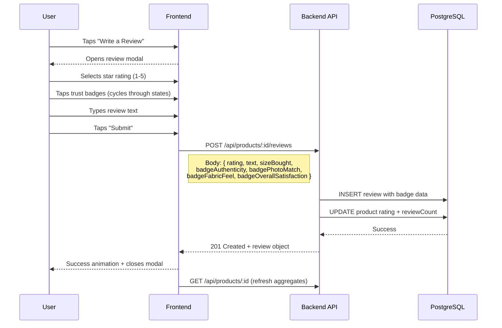
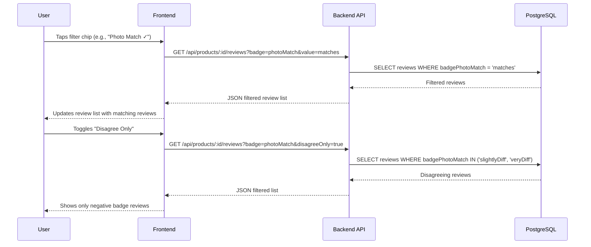
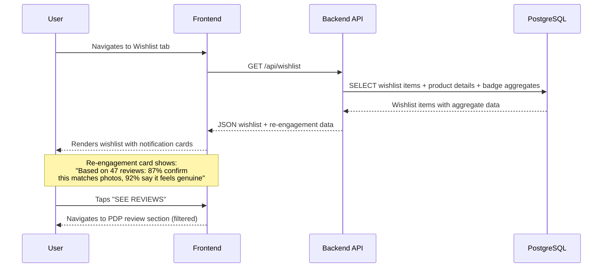
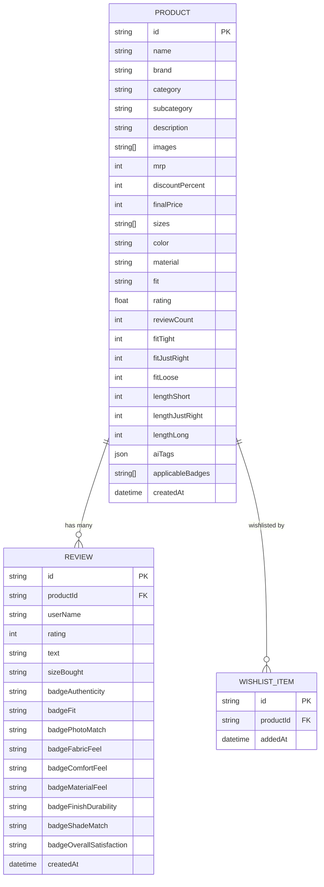
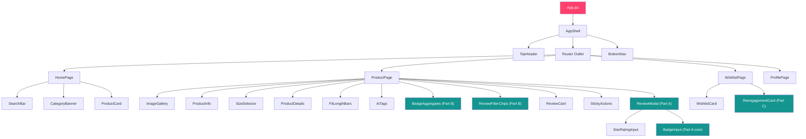
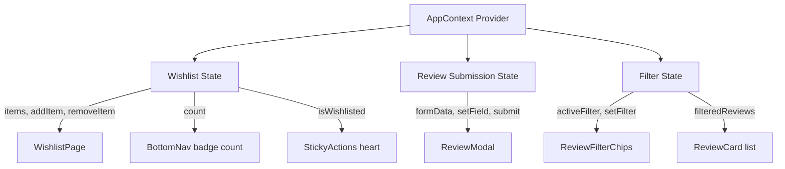

# Architecture — Myntra Trust-Verified Review System MVP (v2)

## 1. System Overview

A mobile-app-shaped web application that layers a **trust-verified review badge system** into Myntra's existing product discovery and purchase flow. The system has three interconnected parts:

| Part | Feature | User Touchpoint |
|------|---------|-----------------|
| **A** | Tap-Based Trust Badges | Review submission flow (post-purchase) |
| **B** | Filterable Review Dashboard | Product Detail Page (pre-purchase) |
| **C** | Wishlist Re-Engagement | Wishlist page (stalled-intent recovery) |

### High-Level Architecture

```mermaid
graph TB
    subgraph Client ["Frontend (Vercel)"]
        direction TB
        SHELL[App Shell — Phone Frame]
        SHELL --> ROUTER[React Router v7]
        ROUTER --> HOME[Home Page]
        ROUTER --> PDP[Product Detail Page]
        ROUTER --> WISH[Wishlist Page]
        ROUTER --> PROF[Profile Page]
        PDP --> REVIEW_MODAL[Review Modal — Part A]
        PDP --> BADGE_AGG[Badge Aggregates — Part B]
        PDP --> FILTER[Filter Chips — Part B]
        WISH --> REENGAGE[Re-engagement Cards — Part C]
    end

    subgraph Server ["Backend (Railway)"]
        direction TB
        EXPRESS[Express.js API Server]
        EXPRESS --> PROD_ROUTES[/api/products]
        EXPRESS --> REV_ROUTES[/api/reviews]
        EXPRESS --> WISH_ROUTES[/api/wishlist]
        PRISMA[Prisma ORM]
        PROD_ROUTES --> PRISMA
        REV_ROUTES --> PRISMA
        WISH_ROUTES --> PRISMA
    end

    subgraph Database ["PostgreSQL (Railway Addon)"]
        DB[(PostgreSQL)]
    end

    Client -->|HTTPS REST API| Server
    PRISMA --> DB

    style SHELL fill:#FF3F6C,color:#fff
    style EXPRESS fill:#282c3f,color:#fff
    style DB fill:#14958F,color:#fff
```

---

## 2. Tech Stack

### Frontend

| Technology | Version | Purpose |
|------------|---------|---------|
| **React** | 18+ | UI component framework |
| **Vite** | 6+ | Build tool, dev server, HMR |
| **Tailwind CSS** | v4 | Utility-first styling with custom Myntra tokens |
| **React Router** | v7 | Client-side routing (SPA) |
| **Lucide React** | Latest | Icon library |
| **Google Fonts** | — | Assistant + Roboto typefaces |

### Backend

| Technology | Version | Purpose |
|------------|---------|---------|
| **Node.js** | 20 LTS | Runtime |
| **Express.js** | 4.x | HTTP server, routing, middleware |
| **Prisma** | 6.x | ORM, schema management, migrations |
| **PostgreSQL** | 16 | Relational database |
| **cors** | Latest | Cross-origin resource sharing |
| **dotenv** | Latest | Environment variable management |

### Deployment

| Service | Platform | Purpose |
|---------|----------|---------|
| Frontend | **Vercel** | Static site + SPA hosting, CDN, auto-deploy from Git |
| Backend | **Railway** | Node.js hosting, auto-deploy from Git |
| Database | **Railway PostgreSQL** | Managed PostgreSQL addon |

---

## 3. Data Flow

### 3.1 Product Browsing (Home → PDP)



### 3.2 Review Submission with Badges (Part A)



### 3.3 Filtered Review Dashboard (Part B)



### 3.4 Wishlist Re-Engagement (Part C)



---

## 4. Database Schema

### Entity Relationship Diagram



### Badge Field Values

| Badge Field | Possible Values |
|-------------|-----------------|
| `badgeAuthenticity` | `null` · `"feelsGenuine"` · `"feelsOff"` |
| `badgeFit` | `null` · `"fitsAsExpected"` · `"doesntFit"` |
| `badgePhotoMatch` | `null` · `"matches"` · `"slightlyDiff"` · `"veryDiff"` |
| `badgeFabricFeel` | `null` · `"asDescribed"` · `"thinnerRougher"` |
| `badgeComfortFeel` | `null` · `"comfortable"` · `"stiffUncomfortable"` |
| `badgeMaterialFeel` | `null` · `"sturdyPremium"` · `"flimsy"` |
| `badgeFinishDurability` | `null` · `"holdsShinColor"` · `"tarnishedFaded"` |
| `badgeShadeMatch` | `null` · `"matchesShade"` · `"differentShade"` |
| `badgeOverallSatisfaction` | `null` · `"satisfied"` · `"notSatisfied"` |

`null` = "Not Sure Yet" (default / not submitted)

### Badge → Category Mapping (v2)

> **v2 change:** Clothing & Footwear no longer get Overall Satisfaction. They get a new **Fit** badge instead.

| Category | Authenticity | Photo Match | Fit | 3rd/4th Badge | Overall Satisfaction | Max Badges |
|----------|:-----------:|:-----------:|:---:|-----------|:-------------------:|:----------:|
| Clothing | ✅ | ✅ | ✅ | Fabric Feel | ❌ | 4 |
| Footwear | ✅ | ✅ | ✅ | Comfort/Sole Feel | ❌ | 4 |
| Bags & Accessories | ✅ | ✅ | ❌ | Material Feel | ✅ | 4 |
| Jewelry & Watches | ✅ | ✅ | ❌ | Finish Durability | ✅ | 4 |
| Makeup | ✅ | ❌ | ❌ | Shade/Result Match | ✅ | 3 |
| Skincare | ✅ | ❌ | ❌ | — | ✅ | 2 |
| Haircare | ✅ | ❌ | ❌ | — | ✅ | 2 |
| Fragrance | ✅ | ❌ | ❌ | — | ✅ | 2 |
| Appliances | ✅ | ❌ | ❌ | — | ✅ | 2 |

---

## 5. API Design

### Base URL
- **Development**: `http://localhost:3001/api`
- **Production**: `https://<railway-app>.railway.app/api`

### Endpoints

#### Products

```
GET    /api/products                    → List all products
       ?category=clothing              → Filter by category
       
GET    /api/products/:id               → Product detail with badge aggregates
GET    /api/products/:id/badge-aggregates → Badge aggregates only
```

#### Reviews

```
GET    /api/products/:id/reviews        → All reviews for a product
       ?badge=photoMatch               → Filter by badge type
       ?value=matches                  → Filter by badge value
       ?disagreeOnly=true              → Only negative badge values
       ?rating=5                       → Filter by star rating
       ?sort=mostHelpful|newest        → Sort order
       
POST   /api/products/:id/reviews        → Submit a new review
```

#### Wishlist

```
GET    /api/wishlist                     → Get all wishlist items with re-engagement data
POST   /api/wishlist/:productId          → Add product to wishlist
DELETE /api/wishlist/:productId          → Remove from wishlist
```

### Response Shapes

#### Product List Item
```json
{
  "id": "clx1abc...",
  "name": "Men Slim Fit Casual Shirt",
  "brand": "Roadster",
  "category": "clothing",
  "images": ["/images/product-1-a.jpg"],
  "mrp": 1699,
  "discountPercent": 62,
  "finalPrice": 649,
  "rating": 4.2,
  "reviewCount": 156,
  "badgeSummary": {
    "topBadge": "92% Feels Genuine",
    "totalBadgeReviews": 120
  }
}
```

#### Product Detail (with Badge Aggregates)
```json
{
  "id": "clx1abc...",
  "name": "Men Slim Fit Casual Shirt",
  "brand": "Roadster",
  "...": "...full product fields...",
  "badgeAggregates": {
    "authenticity": {
      "total": 120,
      "feelsGenuine": 110,
      "feelsOff": 10,
      "percentPositive": 92,
      "belowThreshold": false
    },
    "photoMatch": {
      "total": 98,
      "matches": 85,
      "slightlyDiff": 10,
      "veryDiff": 3,
      "percentPositive": 87,
      "belowThreshold": false
    },
    "fabricFeel": {
      "total": 88,
      "asDescribed": 69,
      "thinnerRougher": 19,
      "percentPositive": 78,
      "belowThreshold": false
    },
    "overallSatisfaction": {
      "total": 130,
      "satisfied": 124,
      "notSatisfied": 6,
      "percentPositive": 95,
      "belowThreshold": false
    }
  }
}
```

> **Minimum-sample threshold (v2)**: When `total < 50` for any badge, `belowThreshold` is `true`. Display rules:
> - `0 submissions` → badge/stat not shown at all
> - `1–49 submissions` → raw count or "gaining traction" momentum copy, NOT percentage
> - `50+ submissions` → full percentage breakdown

#### Review Item
```json
{
  "id": "clx2def...",
  "userName": "Aarav Sharma",
  "rating": 5,
  "text": "Great quality shirt, fabric feels exactly as described...",
  "sizeBought": "40",
  "badges": {
    "authenticity": "feelsGenuine",
    "photoMatch": "matches",
    "fabricFeel": "asDescribed",
    "overallSatisfaction": "satisfied"
  },
  "createdAt": "2025-12-03T10:00:00Z"
}
```

#### Wishlist Item (with Re-Engagement Data)
```json
{
  "id": "clx3ghi...",
  "product": {
    "id": "clx1abc...",
    "name": "Men Slim Fit Casual Shirt",
    "brand": "Roadster",
    "images": ["/images/product-1-a.jpg"],
    "finalPrice": 649,
    "rating": 4.2
  },
  "addedAt": "2026-08-25T10:00:00Z",
  "daysStalled": 3,
  "reengagement": {
    "hasData": true,
    "message": "Based on 120 reviews: 92% confirm it feels genuine, 87% say it matches photos",
    "badges": [
      { "label": "Feels Genuine", "percent": 92 },
      { "label": "Matches Photos", "percent": 87 }
    ],
    "deepLinkFilter": "authenticity"
  }
}
```

---

## 6. Frontend Component Architecture

### Component Tree



### Key Component Specifications

#### BadgeInput (Part A — Core Innovation)

The central interactive component. A single badge renders as one tappable card that cycles through states:

```
┌─────────────────────────┐
│  [icon]  NOT SURE YET   │  ← Default: grey border, grey fill
│                         │     Tap →
├─────────────────────────┤
│  [icon]  FEELS GENUINE  │  ← Positive: pink border, pink tint
│                    ✅   │     Tap →
├─────────────────────────┤
│  [icon]  FEELS OFF /    │  ← Negative: maroon border, red tint
│  LOWER QUALITY     ✖   │     Tap →
├─────────────────────────┤
│  (cycles back to default)│
└─────────────────────────┘
```

- Touch target: minimum 44×44px
- Transition: 200ms ease-out on border color, background, icon swap
- Photo Match has 4 states (adds "Slightly Different" in amber between positive and negative)

#### BadgeAggregates (Part B)

Horizontal scrollable row of aggregate stat cards:

```
┌──────────┐ ┌──────────┐ ┌──────────┐ ┌──────────┐
│ 🛡️  92%  │ │ 📷  87%  │ │ 🧵  78%  │ │ 👍  95%  │
│  Feels   │ │ Matches  │ │ Fabric   │ │Satisfied │
│ Genuine  │ │ Photos   │ │As Descr. │ │          │
└──────────┘ └──────────┘ └──────────┘ └──────────┘
```

- Below threshold (< 50 reviews): shows "X of Y confirm..." or "Gaining traction" instead of %
- Card styling: subtle border, icon on top, percentage bold, label smaller

#### ReengagementCard (Part C)

Notification-style card on wishlist page:

```
┌────────────────────────────────────────┐
│ 🔔 Trust insights for your wishlist    │
│                                        │
│ [Product Thumbnail]                    │
│ Based on 120 reviews:                  │
│ • 92% confirm it feels genuine         │
│ • 87% say it matches photos            │
│                                        │
│          [ SEE REVIEWS → ]             │
└────────────────────────────────────────┘
```

- Appears only for products with sufficient badge data
- "SEE REVIEWS" deep-links to PDP with badge filter pre-applied
- Aggregate data only — never attributes to individual reviewer

---

## 7. State Management



**Approach:** React Context + `useReducer` for global state (wishlist items, active filters). Component-local state for form inputs (review modal). Server state fetched on mount and refetched after mutations.

No Redux — the state graph is simple enough that Context handles it cleanly without the boilerplate.

---

## 8. Mobile-App Frame Strategy

### Desktop (viewport > 430px)

```
┌──────────────────────────────────────────────────────┐
│                                                      │
│              Dark background (#1a1a2e)               │
│                                                      │
│          ┌──────────────────────┐                     │
│          │    ┌────────────┐    │                     │
│          │    │ Top Header │    │                     │
│          │    ├────────────┤    │                     │
│          │    │            │    │                     │
│          │    │  Scrollable│    │  max-width: 430px   │
│          │    │  Content   │    │  height: 100vh      │
│          │    │  Area      │    │  overflow-y: auto   │
│          │    │            │    │  rounded-3xl        │
│          │    │            │    │  box-shadow          │
│          │    ├────────────┤    │                     │
│          │    │ Bottom Nav │    │                     │
│          │    └────────────┘    │                     │
│          └──────────────────────┘                     │
│                                                      │
└──────────────────────────────────────────────────────┘
```

### Mobile (viewport ≤ 430px)

```
┌────────────────────┐
│    Top Header      │
├────────────────────┤
│                    │
│   Scrollable       │  width: 100vw
│   Content          │  height: 100vh
│   Area             │  no border-radius
│                    │  no shadow
│                    │
├────────────────────┤
│    Bottom Nav      │
└────────────────────┘
```

CSS implementation:
```css
/* Outer wrapper */
.app-frame {
  /* Desktop: centered phone */
  @media (min-width: 431px) {
    display: flex;
    justify-content: center;
    align-items: center;
    min-height: 100vh;
    background: #1a1a2e;
  }
}

/* Inner phone container */
.app-container {
  width: 100%;
  max-width: 430px;
  height: 100vh;
  overflow-y: auto;
  background: #ffffff;

  @media (min-width: 431px) {
    border-radius: 2rem;
    box-shadow: 0 25px 60px rgba(0,0,0,0.4);
    height: 90vh;
  }
}
```

---

## 9. Design System Reference

### Color Tokens

```css
@theme {
  --color-myntra-pink:        #FF3F6C;
  --color-myntra-pink-light:  #FFF0F3;
  --color-myntra-dark:        #282C3F;
  --color-myntra-secondary:   #535766;
  --color-myntra-muted:       #94969F;
  --color-myntra-green:       #14958F;
  --color-myntra-rating:      #388E3C;
  --color-myntra-amber:       #F5A623;
  --color-myntra-red:         #D5284F;
  --color-myntra-maroon:      #6D1A36;
  --color-myntra-bg:          #FFFFFF;
  --color-myntra-section:     #F5F5F6;
  --color-myntra-border:      #D4D5D9;
  --color-myntra-border-light:#EAEAEC;
  --color-myntra-star:        #FFC700;
  --color-myntra-discount:    #FF905A;
  --color-badge-positive-bg:  #FFF0F3;
  --color-badge-negative-bg:  #FEF0EF;
  --color-badge-amber-bg:     #FFF8E7;
}
```

### Typography Scale

| Usage | Size | Weight | Color |
|-------|------|--------|-------|
| Brand name (PDP) | 16px | 700 (Bold) | `--myntra-dark` |
| Product name | 14px | 400 | `--myntra-secondary` |
| Price (sale) | 20px | 700 | `--myntra-dark` |
| MRP (strikethrough) | 14px | 400 | `--myntra-muted` |
| Discount % | 14px | 600 | `--myntra-discount` |
| Section headers | 16px | 700 | `--myntra-dark` |
| Body text | 14px | 400 | `--myntra-secondary` |
| Badge label | 11px | 600 | varies by state |
| Badge percentage | 18px | 700 | varies by state |
| Button text | 14px | 700 | white or `--myntra-pink` |
| Rating pill | 13px | 700 | white on `--myntra-rating` |

### Spacing System

| Token | Value | Usage |
|-------|-------|-------|
| `xs` | 4px | Tight spacing, inline gaps |
| `sm` | 8px | Card padding, icon margins |
| `md` | 12px | Section padding |
| `lg` | 16px | Page horizontal padding |
| `xl` | 20px | Section vertical gaps |
| `2xl` | 24px | Major section separators |
| `3xl` | 32px | Page top/bottom padding |

---

## 10. Security & Constraints

| Constraint | Implementation |
|------------|---------------|
| No monetary incentives | No reward/gamification language anywhere in UI |
| Badges are additive only | Star rating + text review flow remains untouched; badges are an optional step before text |
| Aggregate data only | Badge percentages shown on PDP and wishlist — never "User X said it feels genuine" |
| Minimum-sample threshold | < 50 badge submissions → show raw count/momentum copy, not percentage. 0 submissions → nothing shown. |
| Review window | Badge prompt only appears in the review submission flow (post-delivery context implied) |
| CORS | Backend only accepts requests from the Vercel frontend domain |

---

## 11. Environment Variables

### Frontend (Vercel)

| Variable | Example | Purpose |
|----------|---------|---------|
| `VITE_API_URL` | `https://myntra-mvp-api.railway.app` | Backend API base URL |

### Backend (Railway)

| Variable | Example | Purpose |
|----------|---------|---------|
| `DATABASE_URL` | `postgresql://...` | PostgreSQL connection string (auto from Railway) |
| `PORT` | `3001` | Server port (auto from Railway) |
| `FRONTEND_URL` | `https://myntra-mvp.vercel.app` | Allowed CORS origin |
| `NODE_ENV` | `production` | Environment flag |

---

## 12. Performance Considerations

| Concern | Mitigation |
|---------|------------|
| Badge aggregate computation | Aggregates computed on backend per-request (dataset is small — 12 products, ~150 reviews). If scale were a concern, would cache in Redis or denormalize into product table. |
| Image loading | Product images served from Vercel's CDN (`/public/images/`). Lazy loading with `loading="lazy"` attribute. |
| API latency | Railway and Vercel both deploy on global edge. CORS preflight cached with `Access-Control-Max-Age`. |
| Bundle size | Vite tree-shakes unused code. Lucide icons imported individually. No heavy UI library (no Material-UI, Ant Design). |
| Mobile performance | CSS animations use `transform` and `opacity` only (GPU-accelerated). No layout thrashing. |
