hi# Implementation Plan — Myntra Trust-Verified Review System MVP
# v2 — Updated to match newproblemstatement.md

> **Phased build plan with task-level granularity.**  
> Each phase has a clear deliverable, dependency chain, and verification checkpoint before moving to the next.

---

## Phase Overview

```mermaid
gantt
    title Build Timeline
    dateFormat  X
    axisFormat %s

    section Phase 1
    Project Scaffolding           :p1, 0, 1
    
    section Phase 2
    Backend Foundation            :p2, 1, 3
    
    section Phase 3
    Frontend Shell                :p3, 3, 5
    
    section Phase 4
    Core Pages                    :p4, 5, 8
    
    section Phase 5
    Trust Badge System            :p5, 8, 11
    
    section Phase 6
    Polish + Images               :p6, 11, 13
    
    section Phase 7
    Deploy + Verify               :p7, 13, 14
```



| Phase | Name | Depends On | Key Deliverable |
|-------|------|------------|-----------------|
| 1 | Project Scaffolding | — | Both projects initialized, dependencies installed, dev servers running |
| 2 | Backend Foundation | Phase 1 | Prisma schema (with `badgeFit`), seed data (50+ reviews for demo products), all API endpoints tested |
| 3 | Frontend Shell | Phase 1 | Phone frame, routing, header, bottom nav, API client |
| 4 | Core Pages | Phase 2 + 3 | Home grid, full PDP (above + below fold), existing Myntra patterns |
| 5 | Trust Badge System | Phase 4 | Part A (badge submission) + Part B (aggregates + filters + touchpoint content map) + Part C (wishlist re-engagement with funnel) |
| 6 | Polish + Images | Phase 5 | AI-generated product images, animations, micro-interactions, responsive fine-tuning |
| 7 | Deploy + Verify | Phase 6 | Live on Vercel + Railway, seeded production DB, end-to-end tested |

---

## v2 Changelog — Key Differences from v1

> These changes permeate the entire plan. Listed here so every phase references back.

| Area | v1 | v2 |
|------|----|----|
| **Overall Satisfaction** | Universal — all categories | Excluded from Clothing & Footwear |
| **Fit badge** | Did not exist | New badge for Clothing & Footwear: `Fits as Expected / Doesn't Fit as Expected` |
| **Clothing badges** | authenticity, photoMatch, fabricFeel, overallSatisfaction | authenticity, photoMatch, **fit**, fabricFeel |
| **Footwear badges** | authenticity, photoMatch, comfortFeel, overallSatisfaction | authenticity, photoMatch, **fit**, comfortFeel |
| **Bags badges** | authenticity, photoMatch, materialFeel, overallSatisfaction | authenticity, photoMatch, overallSatisfaction, materialFeel |
| **Jewelry badges** | authenticity, photoMatch, finishDurability, overallSatisfaction | authenticity, photoMatch, overallSatisfaction, finishDurability |
| **Min threshold** | 5 submissions | **50 submissions** |
| **Below-threshold copy** | "X reviewers so far" | Raw count or "gaining traction"-style momentum copy (exact variants TBD — open item) |
| **Core user journey** | Not documented | Explicit funnel: Entry → Wishlist → Product Page → Checkout |
| **Touchpoint content** | Uniform across surfaces | Differentiated by proximity to purchase (Section 8 of spec) |
| **Notification rules** | Not specified | Capped 1 per item, aggregate-only, price/discount takes priority, deep-links to PDP |

---

## Phase 1: Project Scaffolding

> **Goal:** Both frontend and backend projects initialized, dependencies installed, dev servers running.

### Tasks

- [ ] **1.1 — Initialize frontend project**
  - Run `npm create vite@latest ./frontend -- --template react`
  - Install dependencies: `tailwindcss @tailwindcss/vite react-router lucide-react`
  - Configure `vite.config.js` with Tailwind plugin + proxy to backend
  - Verify `npm run dev` starts without errors

- [ ] **1.2 — Initialize backend project**
  - Create `backend/` directory with `npm init -y`
  - Install dependencies: `express prisma @prisma/client cors dotenv`
  - Install dev dependencies: `nodemon`
  - Create `src/index.js` with basic Express server (health check endpoint)
  - Add scripts: `"dev": "nodemon src/index.js"`, `"start": "node src/index.js"`
  - Verify `npm run dev` starts on port 3001

- [ ] **1.3 — Initialize Prisma**
  - Run `npx prisma init` in backend
  - Configure `datasources` in `schema.prisma` for SQLite (local dev) / PostgreSQL (production)
  - Set up `.env` with local database connection string
  - Verify `npx prisma db push` connects to database

- [ ] **1.4 — Create project-level files**
  - Root `README.md` with project overview, setup instructions, and architecture link
  - Root `.gitignore` covering both frontend and backend
  - `frontend/.env.example` with `VITE_API_URL=http://localhost:3001`
  - `backend/.env.example` with `DATABASE_URL` and `PORT`

### Files Created

```
Graduation_project_mvp/
├── README.md
├── .gitignore
├── frontend/
│   ├── package.json
│   ├── vite.config.js
│   ├── index.html
│   ├── .env.example
│   └── src/
│       ├── main.jsx
│       └── App.jsx
└── backend/
    ├── package.json
    ├── .env
    ├── .env.example
    ├── prisma/
    │   └── schema.prisma
    └── src/
        └── index.js
```

### Verification Checkpoint
- [ ] `frontend/`: `npm run dev` → opens browser at localhost:5173 with Vite welcome page
- [ ] `backend/`: `npm run dev` → `GET http://localhost:3001/health` returns `{ status: "ok" }`
- [ ] Prisma: `npx prisma db push` succeeds against local database

---

## Phase 2: Backend Foundation

> **Goal:** Full database schema (including `badgeFit`), realistic seed data with 50+ reviews on demo products, all API endpoints returning valid responses.

### Tasks

- [ ] **2.1 — Define Prisma schema**
  - Create `Product` model with all fields (name, brand, category, images, pricing, fit/length data, AI tags, applicableBadges)
  - Create `Review` model with **9 badge fields** (all 8 from v1 + new `badgeFit`) + rating + text
  - Create `WishlistItem` model with unique product constraint
  - Run `npx prisma db push` to apply schema

  > **v2 change:** `badgeFit String?` added to Review model

- [ ] **2.2 — Build seed script + seed data JSON**
  - Create `DOCS/seed-data.json` (single source of truth for seed data)
  - Create `prisma/seed.js` (reads from seed-data.json)
  - Define 12 products across 7 categories with realistic data:
    1. Roadster Men Slim Fit Casual Shirt (Clothing/Men)
    2. INVICTUS Formal Trousers (Clothing/Men)
    3. Libas Floral Anarkali Kurta Set (Clothing/Women)
    4. H&M Oversized T-shirt (Clothing/Unisex)
    5. Campus Running Sports Shoes (Footwear/Men)
    6. Mast & Harbour Block Heel Sandals (Footwear/Women)
    7. Lavie Women's Handbag (Bags)
    8. Wildcraft Unisex Backpack (Bags)
    9. SOHI Gold-Plated Layered Necklace (Jewelry)
    10. Maybelline SuperStay Matte Ink Lipstick (Makeup)
    11. Minimalist 10% Niacinamide Serum (Skincare)
    12. ENVY Natural Spray Perfume (Fragrance)

  **v2 seed data changes:**
  - `applicableBadges` updated per new taxonomy:
    - Clothing: `["authenticity", "photoMatch", "fit", "fabricFeel"]` (no overallSatisfaction)
    - Footwear: `["authenticity", "photoMatch", "fit", "comfortFeel"]` (no overallSatisfaction)
    - Bags: `["authenticity", "photoMatch", "overallSatisfaction", "materialFeel"]`
    - Jewelry: `["authenticity", "photoMatch", "overallSatisfaction", "finishDurability"]`
    - Makeup: `["authenticity", "overallSatisfaction", "shadeMatch"]`
    - Skincare/Haircare/Fragrance/Appliances: `["authenticity", "overallSatisfaction"]`
  - Clothing & Footwear reviews include `badgeFit` values, no `badgeOverallSatisfaction`
  - **Minimum 50+ reviews on at least 2 products** (e.g., prod_1 and prod_5) to demonstrate the full percentage display above the 50-threshold
  - **Some products deliberately kept at 8–15 reviews** to demonstrate the "gaining traction" / raw-count fallback state below 50
  - Pre-seed 3 wishlist items (stalled 2–5 days) for Part C demo
  - Add to `package.json`: `"prisma": { "seed": "node prisma/seed.js" }`
  - Run `npx prisma db seed` and verify data

- [ ] **2.3 — Badge helper utility**
  - Create `src/utils/badgeHelper.js` with:
    - `BADGE_MIN_THRESHOLD = 50` (**v2 change** from 5)
    - `POSITIVE_VALUES` — includes new `fit: 'fitsAsExpected'`
    - `NEGATIVE_VALUES` — includes new `fit: ['doesntFit']`
    - `DISPLAY_LABELS` — includes new `fit: { positive: 'Fits as Expected', short: 'Fit' }`
    - `computeBadgeAggregates(reviews, applicableBadges)` — includes `badgeFit` in badge fields
    - `formatProduct(product, aggregates)` — parses JSON fields

- [ ] **2.4 — Product API routes**
  - `GET /api/products` — list all, with optional `?category=` filter
  - `GET /api/products/:id` — full product detail
  - `GET /api/products/:id/badge-aggregates` — computed from reviews:
    - Count each badge value per badge type
    - Calculate `percentPositive`
    - Set `belowThreshold: true` if `total < 50` (**v2 change** from 5)
  - All product responses include computed `rating` and `reviewCount` from actual reviews
  - Reviews select includes `badgeFit: true`

- [ ] **2.5 — Review API routes**
  - `GET /api/products/:id/reviews` — all reviews for product
    - Query params: `?badge=`, `?value=`, `?disagreeOnly=`, `?rating=`, `?sort=`
    - `BADGE_FIELD_MAP` includes `fit: 'badgeFit'`
    - Filtering logic: if `badge=fit&value=fitsAsExpected` → only reviews where `badgeFit = 'fitsAsExpected'`
    - Disagree logic: if `badge=fit&disagreeOnly=true` → reviews where `badgeFit IN ('doesntFit')`
  - `POST /api/products/:id/reviews` — create review
    - Body includes `badgeFit`
    - After insert: update product's computed `rating` and `reviewCount`
    - Returns 201 with created review

- [ ] **2.6 — Wishlist API routes**
  - `GET /api/wishlist` — all wishlist items with:
    - Full product details
    - Computed `daysStalled` (from `addedAt`)
    - Badge aggregates for re-engagement message
    - Formatted `reengagement` object with `message`, `badges[]`, and `deepLinkFilter`
    - **v2: Touchpoint content rules applied** — Wishlist shows only top 1–2 stats, positive-only (Section 8)
  - `POST /api/wishlist/:productId` — add to wishlist (upsert)
  - `DELETE /api/wishlist/:productId` — remove from wishlist

- [ ] **2.7 — Middleware setup**
  - CORS: allow frontend origin (`http://localhost:5173` dev, `FRONTEND_URL` prod)
  - JSON body parser
  - Error handling middleware (consistent error response shape)
  - Request logging (simple console logger)

### Files Created

```
backend/
├── prisma/
│   ├── schema.prisma          # Full schema (3 models, 9 badge fields on Review)
│   └── seed.js                # Reads from DOCS/seed-data.json
├── src/
│   ├── index.js               # Express app setup + middleware + mount routes
│   ├── routes/
│   │   ├── products.js        # Product endpoints + badge aggregate computation
│   │   ├── reviews.js         # Review CRUD + filtering (includes badgeFit)
│   │   └── wishlist.js        # Wishlist CRUD + re-engagement data
│   ├── utils/
│   │   └── badgeHelper.js     # Badge aggregation, threshold=50, includes fit badge
│   └── middleware/
│       └── errorHandler.js    # Consistent error responses
└── package.json               # Updated with seed config

DOCS/
└── seed-data.json             # Single source of truth for all seed data
```

### Verification Checkpoint
- [ ] `npx prisma db seed` → seeds 12 products, 50+ reviews on key products, 3 wishlist items without errors
- [ ] `GET /api/products` → returns 12 products with correct `applicableBadges` per v2 taxonomy
- [ ] `GET /api/products/prod_1` → clothing product shows `fit` in applicable badges, no `overallSatisfaction`
- [ ] `GET /api/products/prod_1/badge-aggregates` → includes `fit` aggregate, no `overallSatisfaction`
- [ ] Products with 50+ reviews show `belowThreshold: false`; products with <50 show `belowThreshold: true`
- [ ] `GET /api/products/:id/reviews?badge=fit&value=fitsAsExpected` → filtered results
- [ ] `POST /api/products/:id/reviews` with `badgeFit` field → creates review, updates product stats
- [ ] `GET /api/wishlist` → returns items with re-engagement data (positive-only stats per Section 8)

---

## Phase 3: Frontend Shell

> **Goal:** Phone-frame app shell with routing, Myntra header, bottom nav, and API client.

### Tasks

- [ ] **3.1 — Design system CSS**
  - Create `src/index.css` with:
    - `@import "tailwindcss"`
    - `@theme` block with all Myntra color tokens
    - Google Fonts import (`Assistant`)
    - Global resets (smooth scroll, antialiased text, box-sizing)
    - Custom utility classes for Myntra-specific patterns
    - Phone frame styles (desktop vs. mobile)

- [ ] **3.2 — API client module**
  - Create `src/api/client.js`
  - Fetch wrapper with `VITE_API_URL` base
  - Methods: `getProducts()`, `getProduct(id)`, `getBadgeAggregates(id)`, `getReviews(id, filters)`, `submitReview(id, data)`, `getWishlist()`, `addToWishlist(id)`, `removeFromWishlist(id)`
  - Error handling with meaningful error messages

- [ ] **3.3 — App Context**
  - Create `src/context/AppContext.jsx`
  - State: `{ wishlistItems, wishlistCount }`
  - Actions: `ADD_TO_WISHLIST`, `REMOVE_FROM_WISHLIST`, `SET_WISHLIST`
  - Fetch wishlist on app mount
  - Provide `isWishlisted(productId)` helper

- [ ] **3.4 — AppShell layout component**
  - Create `src/components/layout/AppShell.jsx`
  - Desktop: dark bg + centered 430px container with rounded corners + shadow
  - Mobile: full viewport, no frame
  - Fixed header at top, fixed nav at bottom, scrollable content area between them
  - `<Outlet />` for routed page content

- [ ] **3.5 — TopHeader component**
  - Create `src/components/layout/TopHeader.jsx`
  - Myntra M logo inside search bar (rounded pill, matching screenshots)
  - Placeholder search text
  - Right side: notification bell, heart (wishlist), profile icon
  - Heart shows wishlist count badge (pink circle)

- [ ] **3.6 — BottomNav component**
  - Create `src/components/layout/BottomNav.jsx`
  - 4 tabs matching Myntra's actual bottom nav:
    - Home (Myntra M icon, pink when active)
    - Categories (grid icon)
    - Wishlist (heart icon + count badge)
    - Profile (user icon)
  - Active tab: pink icon + pink label; inactive: grey icon + grey label
  - `NavLink` from React Router for active state

- [ ] **3.7 — Routing setup**
  - Configure React Router in `App.jsx`
  - Routes:
    - `/` → HomePage
    - `/product/:id` → ProductPage
    - `/wishlist` → WishlistPage
    - `/categories` → CategoriesPage
    - `/profile` → ProfilePage
  - Wrap all routes inside `<AppShell>`

### Files Created

```
frontend/src/
├── index.css                    # Design system + phone frame
├── App.jsx                      # Router setup
├── main.jsx                     # Entry point with providers
├── api/
│   └── client.js                # API fetch wrapper
├── context/
│   └── AppContext.jsx           # Wishlist global state
└── components/
    └── layout/
        ├── AppShell.jsx         # Phone frame + content area
        ├── TopHeader.jsx        # Myntra header bar
        └── BottomNav.jsx        # Bottom navigation tabs
```

### Verification Checkpoint
- [ ] App opens in browser with phone frame centered on desktop
- [ ] On mobile viewport (< 430px), frame fills screen naturally
- [ ] Header shows Myntra-style search bar with icons
- [ ] Bottom nav shows 4 tabs, active tab highlights in pink
- [ ] Clicking tabs navigates between blank pages (routing works)
- [ ] API client can fetch from backend (no CORS errors)
- [ ] Wishlist count badge updates in bottom nav

---

## Phase 4: Core Pages

> **Goal:** Home grid with product cards, full PDP matching Myntra screenshots (above + below fold), existing Myntra review patterns.

### Tasks

- [ ] **4.1 — ProductCard component**
  - Create `src/components/home/ProductCard.jsx`
  - Match Myntra's exact product card layout (from screenshots):
    - Product image (3:4 ratio, object-cover)
    - Rating pill overlay bottom-left (green bg, "4.2 ★ 1.1k")
    - Brand name bold, product name truncated in grey
    - MRP strikethrough + sale price bold + orange discount %
    - Heart icon (top-right) for wishlist toggle
  - **v2: Badge summary tag below price** — shows single strongest positive stat (Section 8: Homepage = 1 stat, positive-only)
  - Clickable → navigates to `/product/:id`

- [ ] **4.2 — HomePage**
  - Create `src/pages/HomePage.jsx`
  - Category tabs: ALL | MEN | WOMEN | KIDS (pink underline on active)
  - Category bubble scroll row (horizontal): Fashion 👗, Footwear 👟, Bags 👜, Jewelry 💍, Beauty 💄, Skincare ✨, Perfumes 🌸
  - Hero promo banner (Trust-Verified Collection)
  - 2-column product grid
  - Fetch products from API, filter by category
  - Loading skeleton while fetching

- [ ] **4.3 — CategoriesPage**
  - Create `src/pages/CategoriesPage.jsx`
  - Full category list with icons, item counts, subcategory labels
  - **v2: Incorporates Search/Category touchpoint** — wishlisted items in matching categories can show thumbnail + product name only, no stat (per Section 8 search/category rule)

- [ ] **4.4 — ImageGallery component**
  - Create `src/components/pdp/ImageGallery.jsx`
  - Full-width product images, horizontal scroll/swipe
  - Dot indicators at bottom
  - Rating pill at bottom-right of image
  - Touch swipe support for mobile

- [ ] **4.5 — ProductInfo component**
  - Create `src/components/pdp/ProductInfo.jsx`
  - Brand name **BOLD UPPERCASE** + product description
  - MRP ₹X (strikethrough) + ₹finalPrice (bold large) + "XX% OFF!" (pink badge)
  - Coupon offer card

- [ ] **4.6 — SizeSelector component**
  - Create `src/components/pdp/SizeSelector.jsx`
  - "Select Size" header + "Size Chart >" link in pink
  - Horizontal row of size pills
  - Selected pill: pink border; unselected: grey border

- [ ] **4.7 — StickyActions component**
  - Create `src/components/pdp/StickyActions.jsx`
  - Fixed at bottom of PDP (within phone frame)
  - Two buttons: "Buy Now" (outlined) + "Add to Bag" (filled pink)

- [ ] **4.8 — ProductDetails component**
  - Create `src/components/pdp/ProductDetails.jsx`
  - Delivery & Services section
  - Product specs grid
  - "Genuine Product" + "Quality Checked" trust badges

- [ ] **4.9 — FitLengthBars component**
  - Create `src/components/pdp/FitLengthBars.jsx`
  - Myntra's existing fit visualization (Tight–Just Right–Loose, Short–Just Right–Long)

- [ ] **4.10 — AiTags component**
  - Create `src/components/pdp/AiTags.jsx`
  - Myntra's existing AI-summarized review tags

- [ ] **4.11 — ReviewCard component**
  - Create `src/components/pdp/ReviewCard.jsx`
  - Match Myntra's review card:
    - Green star rating pill + date + "Size: X" tag
    - Review text with "...read more" truncation
    - Verified buyer name with green checkmark
    - "Helpful?" with thumbs up
  - **v2: Badge pill list includes `fit` badge** with Ruler icon

- [ ] **4.12 — ProductPage assembly**
  - Create `src/pages/ProductPage.jsx`
  - Fetch product data + reviews from API
  - Assemble all PDP components in correct order
  - **v2: Product page is the conversion point** — shows FULL badge panel with ALL states, complete unfiltered data (Section 8: Product page = everything, including negative/mixed stats)

- [ ] **4.13 — ProfilePage**
  - Create `src/pages/ProfilePage.jsx`
  - Profile layout: avatar, name, menu items

### Files Created

```
frontend/src/
├── components/
│   ├── home/
│   │   └── ProductCard.jsx
│   └── pdp/
│       ├── ImageGallery.jsx
│       ├── ProductInfo.jsx
│       ├── SizeSelector.jsx
│       ├── StickyActions.jsx
│       ├── ProductDetails.jsx
│       ├── FitLengthBars.jsx
│       ├── AiTags.jsx
│       └── ReviewCard.jsx
├── pages/
│   ├── HomePage.jsx
│   ├── CategoriesPage.jsx
│   ├── ProductPage.jsx
│   └── ProfilePage.jsx
└── utils/
    ├── badgeConfig.js           # Frontend badge taxonomy (includes fit badge, v2 mappings)
    └── imageHelper.js           # Image fallback utility
```

### Verification Checkpoint
- [ ] Home page loads product grid from API, displays 12 products in 2 columns
- [ ] Product cards show single positive stat badge summary (Section 8 homepage rule)
- [ ] Category tabs filter the grid correctly
- [ ] Tapping a product card navigates to PDP
- [ ] PDP shows full product detail matching Myntra screenshots
- [ ] Clothing/footwear PDP shows fit badge in review cards, no overallSatisfaction
- [ ] Bags/jewelry PDP shows overallSatisfaction, no fit badge
- [ ] "Buy Now" + "Add to Bag" buttons sticky at bottom

---

## Phase 5: Trust Badge System (Core Innovation)

> **Goal:** Implement all 3 parts — badge submission (A), filtered dashboard (B), wishlist re-engagement with funnel (C).
> v2 adds: touchpoint content map differentiation, core user journey funnel, 50-threshold handling.

### Part A — Tap-Based Trust Badges in Review Flow

- [ ] **5.1 — BadgeInput component**
  - Create `src/components/review/BadgeInput.jsx`
  - Single tappable badge card that cycles through states on tap:
    - Default: grey border, grey icon, "NOT SURE YET" text
    - Positive: pink border, pink tint background, positive label
    - Negative: maroon border, red tint background, negative label
    - Photo Match: 4 states (adds "SLIGHTLY DIFFERENT" in amber)
    - **v2: Fit badge**: 2 selected states — "FITS AS EXPECTED" (positive) / "DOESN'T FIT AS EXPECTED" (negative)
  - Transitions: 200ms ease-out on border, background, icon
  - Touch target: min 44×44px

- [ ] **5.2 — StarRatingInput component**
  - Create `src/components/review/StarRatingInput.jsx`
  - 5 tappable stars, empty → filled gold on tap

- [ ] **5.3 — ReviewModal component**
  - Create `src/components/review/ReviewModal.jsx`
  - Full-screen modal overlay (slides up from bottom)
  - Step flow (all on one scrollable page):
    1. Product thumbnail + name
    2. Star rating input
    3. **Trust badges section** (sequenced BEFORE text per spec — reduces response effort)
       - Only shows badges applicable to this product's category per v2 taxonomy
       - Clothing/Footwear: 4 badges including Fit, no Overall Satisfaction
       - Bags/Jewelry: 4 badges including Overall Satisfaction
       - Makeup: 3 badges
       - Skincare/Haircare/Fragrance/Appliances: 2 badges
    4. Text review textarea
    5. Size bought selector
    6. "SUBMIT REVIEW" button
  - On submit: POST to API (includes `badgeFit`), success toast, close, refetch

- [ ] **5.4 — Wire up "WRITE A REVIEW" button**
  - In ProductPage, connect the review button to open ReviewModal
  - Pass product ID, category, and applicable badges to modal
  - After successful submission, refetch reviews and badge aggregates

### Part B — Filterable Review Dashboard + Badge Panel

- [ ] **5.5 — BadgeAggregates component**
  - Create `src/components/pdp/BadgeAggregates.jsx`
  - Horizontal scrollable row of aggregate stat cards
  - Each card shows: Badge icon + Percentage bold + Label
  - **v2 threshold handling (50 submissions):**
    - `0 submissions` → badge/stat not shown at all
    - `1–49 submissions` → Raw count: "X of Y confirm..." or "Gaining traction — X reviews so far"
    - `50+ submissions` → Full percentage breakdown
  - **v2: Fit badge card** shown for clothing/footwear (Ruler icon, "X% Fits as Expected")
  - **v2: Product page shows EVERYTHING** — full panel, all badges with state-by-state % breakdown, including negative/mixed stats (Section 8)

- [ ] **5.6 — ReviewFilterChips component**
  - Create `src/components/pdp/ReviewFilterChips.jsx`
  - Horizontal scrollable chip row:
    - "All" (default active)
    - Badge-specific filters including **"Fit ✓"** for clothing/footwear
    - Star rating filters
  - "Disagree Only" toggle
  - On chip tap: call API with filter params, update review list

- [ ] **5.7 — Add badge pills to ReviewCard**
  - Update `ReviewCard.jsx` to show inline badge pills
  - **v2:** Includes Fit badge pill ("✓ Fits as Expected" pink, "✗ Doesn't Fit" red)

- [ ] **5.8 — Integrate Part B into ProductPage**
  - Add BadgeAggregates section above the review list
  - Add ReviewFilterChips between aggregates and review cards
  - Wire up filter state
  - **v2 principle: Product page = full transparency** — shows complete unfiltered data, all badge states with percentages

### Part C — Wishlist Re-Engagement + Core User Journey Funnel

> v2 adds an explicit funnel: Entry → Wishlist → Product Page → Checkout.
> Each touchpoint gets different badge data (Section 8 touchpoint content map).

- [ ] **5.9 — WishlistCard component**
  - Create `src/components/wishlist/WishlistCard.jsx`
  - Product image + brand + name + price
  - "Wishlisted X days ago" timestamp
  - Heart icon (filled) to remove from wishlist
  - **v2: Shows 1–2 top positive stats per item** (Section 8: Wishlist page = top 1–2 strongest stats, positive-only)
  - Tappable → navigates to PDP

- [ ] **5.10 — ReengagementCard component**
  - Create `src/components/wishlist/ReengagementCard.jsx`
  - Notification-style card design:
    - Product thumbnail
    - **v2: Positive-only messaging** — "Based on X reviews: 87% confirm this matches photos"
    - Badge stat pills (positive stats only per Section 8)
    - "SEE REVIEWS" CTA → deep-links to PDP
  - **v2: Only fires/shows if a positive stat exists** (Section 8 notification rule)
  - **v2: Notification-style — capped at 1 badge notification per item**, aggregate-only, no individual reviewer named

- [ ] **5.11 — WishlistPage assembly**
  - Create `src/pages/WishlistPage.jsx`
  - Fetch wishlist from API
  - **v2: Wishlist is the funnel midpoint** — curated positive-leaning badge summary reminding user why they wishlisted
  - Render re-engagement cards at top (for items with badge data)
  - Render wishlist grid below
  - Empty state: "Your wishlist is empty"
  - Handle remove from wishlist (optimistic UI + API call)

- [ ] **5.12 — Homepage badge surfacing** (NEW in v2)
  - In `HomePage.jsx` / `ProductCard.jsx`:
    - **v2: Homepage = lightest treatment** — single strongest positive stat shown per product card, positive-only
    - Same selection logic as Notifications (per Section 8)
    - Feels like a natural aside, not competing with browsing experience

### Files Created

```
frontend/src/
├── components/
│   ├── review/
│   │   ├── BadgeInput.jsx           # Part A core (includes Fit badge)
│   │   ├── StarRatingInput.jsx
│   │   └── ReviewModal.jsx          # Part A flow
│   ├── pdp/
│   │   ├── BadgeAggregates.jsx      # Part B (50-threshold, full panel on PDP)
│   │   └── ReviewFilterChips.jsx    # Part B (includes Fit filter)
│   └── wishlist/
│       ├── WishlistCard.jsx         # Part C (1–2 positive stats)
│       └── ReengagementCard.jsx     # Part C (positive-only notification card)
└── pages/
    └── WishlistPage.jsx
```

### Verification Checkpoint
- [ ] **Part A**: Tap "Write a Review" → modal shows correct badges per v2 taxonomy (Fit for clothing, no Overall Satisfaction for clothing)
- [ ] **Part A**: Fit badge cycles: Not Sure Yet → Fits as Expected → Doesn't Fit as Expected → Not Sure Yet
- [ ] **Part A**: Submit with `badgeFit` value → stored correctly in DB
- [ ] **Part B**: Products with 50+ reviews → show full percentage breakdown
- [ ] **Part B**: Products with 1–49 reviews → show raw count / "gaining traction" copy
- [ ] **Part B**: Products with 0 badge submissions → no badge/stat shown
- [ ] **Part B**: Fit badge aggregate card shows for clothing/footwear
- [ ] **Part B**: Product page shows complete, unfiltered data including negative stats
- [ ] **Part B**: Tap "Fit ✓" filter chip → review list filters correctly
- [ ] **Part C**: Wishlist page shows 1–2 positive stats per item (not full panel)
- [ ] **Part C**: Re-engagement card shows positive-only messaging
- [ ] **Part C**: Tap "SEE REVIEWS" → navigates to PDP
- [ ] **Touchpoints**: Homepage shows single positive stat, wishlist shows 1–2, PDP shows everything

---

## Phase 6: Polish + Product Images

> **Goal:** AI-generated product images, animations, micro-interactions, responsive fine-tuning.

### Tasks

- [ ] **6.1 — Generate product images**
  - Use AI image generation or curated Unsplash URLs for 12 products (3-4 images each)
  - Update seed data or image helper with correct image sources

- [ ] **6.2 — Micro-animations**
  - Badge tap: scale bounce (0.95 → 1.0) + border color transition
  - Wishlist heart: pulse animation on add
  - Review modal: slide up from bottom (300ms ease-out)
  - Success toast: fade in + slide down
  - Product card hover (desktop): subtle lift shadow
  - Re-engagement card: slide in animation on mount

- [ ] **6.3 — Loading states**
  - Skeleton screens for: product grid, PDP, review list
  - Button loading spinners on submit

- [ ] **6.4 — Empty states**
  - Wishlist empty: illustration + "Save items you love" + "START SHOPPING" CTA
  - No reviews matching filter: "No reviews match this filter" + "Clear filters" link
  - No badge data: contextual messaging per v2 threshold rules

- [ ] **6.5 — Responsive fine-tuning**
  - Test at 320px, 375px, 390px, 414px, 430px widths
  - Verify no horizontal overflow, all tap targets ≥ 44px
  - Verify text truncation, scrollbar behavior, bottom nav + sticky actions

- [ ] **6.6 — Accessibility basics**
  - Unique IDs on all interactive elements
  - Alt text on images, aria-labels on icon-only buttons
  - Color contrast WCAG AA

- [ ] **6.7 — Error handling UI**
  - API failure: "Something went wrong" with "Retry" button
  - Review submission failure: inline error, form data preserved

### Verification Checkpoint
- [ ] All 12 products have realistic images loading correctly
- [ ] Animations feel smooth (60fps, no jank)
- [ ] Loading skeletons and empty states work
- [ ] App works correctly at all mobile viewport widths (320px–430px)
- [ ] Visual fidelity: side-by-side with Myntra screenshots shows strong match

---

## Phase 7: Deploy + Verify

> **Goal:** Live on Vercel (frontend) + Railway (backend), seeded production database, end-to-end verified.

### Tasks

- [ ] **7.1 — Prepare backend for deployment**
  - Verify `npm start` works without `nodemon`
  - Ensure all env vars documented
  - Configure for PostgreSQL in production (Railway addon)

- [ ] **7.2 — Deploy backend**
  - Deploy to Railway (or similar)
  - Provision PostgreSQL database
  - Set environment variables: `FRONTEND_URL`, `NODE_ENV=production`
  - Run seed on production
  - Verify health check

- [ ] **7.3 — Prepare frontend for deployment**
  - Verify `npm run build` produces clean output
  - SPA rewrites configured

- [ ] **7.4 — Deploy frontend**
  - Deploy to Vercel (or similar)
  - Set `VITE_API_URL` → backend URL
  - Verify live URL loads correctly

- [ ] **7.5 — End-to-end testing on live URL**
  - Test complete flow:
    1. Browse products on home page — single positive stat shows per card
    2. Tap into product → PDP loads with full badge panel (all states, %)
    3. Badge aggregates: above-50 products show %, below-50 show raw counts
    4. Use filter chips to filter reviews (including Fit filter for clothing)
    5. Toggle "Disagree Only" to see negative reviews
    6. Tap "Write a Review" → fill stars, badges (including Fit), text → submit
    7. Verify new review appears with badge pills (including Fit)
    8. Verify badge aggregates update
    9. Add product to wishlist from PDP
    10. Navigate to wishlist → see 1–2 positive stats per item + re-engagement card
    11. Tap "SEE REVIEWS" → lands on PDP
    12. Remove from wishlist → verify it's removed
  - **v2 verification: Touchpoint content differentiation**
    - Homepage: 1 stat, positive-only ✓
    - Wishlist: 1–2 stats, positive-only ✓
    - Product page: full panel, all states, negative included ✓
  - Test on at least 2 different mobile devices/viewport sizes

- [ ] **7.6 — Final documentation**
  - Update `README.md` with live demo URL, setup instructions
  - Update `DOCS/architecture.md` with v2 changes
  - Update `DOCS/edgecases.md` with v2 edge cases (50-threshold, fit badge)

### Verification Checkpoint
- [ ] Backend live: `GET /health` returns 200
- [ ] Backend API: `GET /api/products` returns 12 products with v2 badge mappings
- [ ] Frontend live: loads correctly, connects to backend
- [ ] Full flow works end-to-end (all 12 steps + touchpoint verification)
- [ ] Works on desktop (phone frame) and mobile (fill viewport)
- [ ] README has live URL and setup instructions

---

## Risk Mitigation

| Risk | Probability | Impact | Mitigation |
|------|-------------|--------|------------|
| 50-threshold means most seeded products show raw counts | High | Medium | Deliberately seed 2+ products with 50+ reviews; remaining products demonstrate the fallback state |
| "Gaining traction" copy variants not finalized (open item #1) | Medium | Low | Ship with reasonable default copy; iterate based on feedback |
| Overall Satisfaction removal from Clothing/Footwear questioned | Low | Low | Document as deliberate trade-off per spec — more specific signal over vague catch-all |
| Fit badge is new and untested visually | Medium | Low | Use Ruler icon from lucide-react; style consistently with other badges |
| AI-generated images look artificial | Medium | Medium | Use Unsplash curated photos as fallback |
| CORS issues between Vercel ↔ Railway | Medium | Low | Pre-configure CORS with explicit origins |
| Category taxonomy not validated against Myntra's real tree | Medium | Medium | Flagged as known gap in spec; acceptable for MVP |

---

## Definition of Done

The MVP is complete when:

- [ ] Live URL accessible on deployment platform
- [ ] All 3 parts functional with v2 taxonomy:
  - **Part A**: Users can submit reviews with tap-based trust badges (including Fit for clothing/footwear, excluding Overall Satisfaction for clothing/footwear)
  - **Part B**: PDP shows FULL badge panel with complete, unfiltered data + filterable review dashboard
  - **Part C**: Wishlist shows re-engagement with positive-only curated stats (1–2 per item)
- [ ] **Touchpoint content differentiation** works per Section 8:
  - Homepage → 1 stat, positive-only
  - Wishlist → 1–2 stats, positive-only
  - Product page → full panel, all states, unfiltered
- [ ] **50-threshold** works correctly:
  - 0 → nothing shown
  - 1–49 → raw count / momentum copy
  - 50+ → full percentage breakdown
- [ ] 12 products seeded across 7 categories with correct v2 badge mappings
- [ ] **Fit badge** works end-to-end (submission → aggregation → filtering → display)
- [ ] Visual fidelity matches Myntra's real app closely
- [ ] Works on desktop (phone frame) and mobile (natural fill)
- [ ] No console errors, no broken layouts, no dead links
