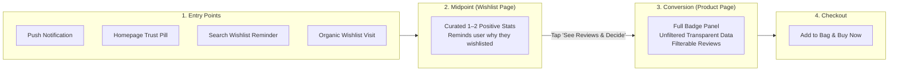

# Myntra Trust-Verified Review System MVP — Complete Feature Guide

> **Project Overview & System Capabilities Document**  
> Comprehensive guide to all features, user flows, touchpoint rules, badge taxonomy, and technical architecture implemented in the MVP.

---

## 📌 1. Executive Summary

### The Problem
Fashion e-commerce suffers from **pre-purchase hesitation** and **stalled wishlist intent**. Customers browse, love a style, and save it to their wishlist, but hesitate to pull the trigger due to trust doubts:
- *"Does the fabric actually feel like the pictures?"*
- *"Will this fit as expected, or run too tight/loose?"*
- *"Is the color accurate to the studio lighting?"*
- *"Is this brand/product 100% genuine?"*

Traditional reviews are walls of unstructured text or easily biased 1–5 star ratings.

### The Solution
The **Myntra Trust-Verified Review System** layers a lightweight, structured, tap-based badge ecosystem into Myntra's existing shopping experience across three interconnected parts:
1. **Part A (Post-Purchase):** 1-tap structured trust badges sequenced *before* text in the review submission modal.
2. **Part B (Pre-Purchase):** Filterable trust dashboard and aggregate confirmation percentages on the Product Detail Page (PDP).
3. **Part C (Intent Recovery):** Contextual social-proof re-engagement notifications and curated trust summaries on saved wishlist items.

---

## 🗺️ 2. The Core User Journey (The Funnel)

The solution is engineered around a single unified conversion funnel:

1. **Entry:** The user is pulled toward their wishlist via ambient notifications, homepage trust pills, search reminders, or direct navigation.
2. **Wishlist (Midpoint):** Shows a curated, positive-leaning 1–2 stat summary reminding the user *why* they saved the item without cognitive overload.
3. **Product Page (Conversion Point):** The user performs final due diligence with full, unfiltered review data, aggregate breakdowns across all badge criteria, and interactive filter chips.
4. **Purchase:** Confident conversion into **Add to Bag → Checkout**.

---

## 💎 3. The Three Core Parts (A, B, and C)

### Part A: Review Submission Flow (Tap-Based Badges)
Located in the **"Write a Verified Review"** modal:

- **1-Tap Dynamic State Cycling:** Each badge is a single card that cycles states upon tapping:
  - Default: `NOT SURE YET` (Neutral grey border)
  - Positive: `FEELS GENUINE` / `FITS AS EXPECTED` (Pink border, pink tint, green checkmark)
  - Negative: `FEELS OFF` / `DOESN'T FIT AS EXPECTED` (Maroon border, red tint, red X)
  - Photo Match (4 states): adds `SLIGHTLY DIFFERENT` (Amber border)
- **New Fit Badge (v2):** Sizing & fit feedback for Clothing & Footwear (`Fits as Expected` / `Doesn't Fit as Expected`).
- **Category-Adaptive Taxonomy:** Only shows the 2 to 4 badges relevant to the specific product category (e.g. Clothing gets Fit + Fabric Feel; Makeup gets Shade Match; Jewelry gets Finish Durability).
- **Sequencing Before Text:** Badges appear *above* the free-text review box to minimize effort and friction.
- **Zero Monetary Incentives:** No gamification, coins, or rewards — ensures organic, trustworthy submissions.

---

### Part B: Product Detail Page (Filterable Trust Dashboard)
Located on the **Product Detail Page (PDP)**:

- **Trust-Verified Aggregate Cards:**
  - Horizontal scrollable carousel showing real buyer confirmation metrics (e.g. `93% Feels Genuine`, `85% Fits as Expected`, `87% Matches Photos`).
  - **50-Submission Threshold Guardrail:**
    - `50+ Submissions:` Full statistical percentage breakdown + visual progress bar.
    - `1–49 Submissions:` Raw count / momentum copy (`"12 of 15 buyers confirm Fits as Expected — Gaining traction"`), preventing small-sample misrepresentation.
    - `0 Submissions:` Card cleanly hidden.
- **Interactive Review Filter Chips:**
  - Filter reviews by specific criteria: `All`, `Photo Match ✓`, `Authenticity ✓`, `Fit ✓`, `Fabric Feel ✓`, `5★`, `4★`, `3★`.
  - **"Disagree / Critical Only" Toggle:** 1-tap switch to inspect only critical/negative buyer feedback for full transparency.
- **Inline Review Badge Pills:**
  - Individual review cards display colored badge pills for the reviewer's verified selections (`✓ Fits as Expected`, `✓ Matches Photos`, `✗ Thinner Than Expected`).

---

### Part C: Wishlist Re-Engagement & Touchpoint Surfacing
Located on the **Wishlist Page**, **Notification Drawer**, and **Top Header**:

- **Stalled-Intent Re-Engagement Cards:**
  - Highlight cards for items wishlisted >1 day with verified buyer milestones.
  - Social proof messaging: *"Based on 54 reviews: 93% confirm it feels genuine, and 85% say it fits as expected."*
  - **"SEE REVIEWS & DECIDE >" CTA:** Deep-links directly into the product page with the respective badge filter pre-applied.
- **Wishlist Product Cards:**
  - Shows days-stalled tags (`Saved 4d ago`) and top 1–2 positive trust pills per item.
- **In-App Notification Center (`Bell` icon in Header):**
  - Slide-out notification drawer listing verified trust milestones for saved items.
  - Live animated unread indicator dot when new trust confirmations are available.
- **Ambient In-App Push Toast:**
  - Floating ambient banner simulating real-time push alerts with 1-tap navigation into review insights.

---

## 🎯 4. Section 8: Touchpoint Content Map ("Detail Scales with Intent")

The MVP implements the **"Detail Scales with Intent"** pattern — the further a surface is from the buying decision, the lighter and more positive the treatment; the closer to the decision (Product page), the more complete and transparent the data.

| Touchpoint | Trigger & Surface | Badge Selection Logic | Detail Shown | Shows Negative Stats? |
|---|---|---|---|:---:|
| **1. Notifications** | Stalled wishlist item crosses milestone | Single strongest positive stat | 1 stat | ❌ Positive-only |
| **2. Homepage** | Product browsing grid (`ProductCard`) | Single strongest positive stat | 1 stat badge summary tag | ❌ Positive-only |
| **3. Search / Category** | Keyword or category match (`SearchOverlay`) | Soft reminder of saved wishlist items | **Thumbnail + Product Name ONLY** (No stats, preventing discovery clutter) | N/A — No stat shown |
| **4. Wishlist Page** | Saved item grid & re-engagement | Top 1–2 strongest positive stats | 1–2 stats per card | ❌ Positive-only |
| **5. Product Page** | Conversion due-diligence (PDP) | Complete aggregate panel & filter chips | Full breakdown across all badge states | ✅ **Full unfiltered transparency** |

---

## 🏷️ 5. Badge Taxonomy per Category (v2)

| Category | Badge 1 (Universal) | Badge 2 | Badge 3 | Badge 4 | Max Badges |
|---|:---:|:---:|:---:|:---:|:---:|
| **Clothing** | Authenticity | Photo Match (3-state) | **Fit** (`Fits as Expected` / `Doesn't Fit`) | **Fabric Feel** (`As Described` / `Thinner/Rougher`) | 4 |
| **Footwear** | Authenticity | Photo Match (3-state) | **Fit** (`Fits as Expected` / `Doesn't Fit`) | **Comfort Feel** (`Comfortable` / `Stiff/Uncomfortable`) | 4 |
| **Bags & Luggage** | Authenticity | Photo Match (3-state) | Overall Satisfaction | **Material Feel** (`Sturdy/Premium` / `Flimsy`) | 4 |
| **Jewelry & Watches** | Authenticity | Photo Match (3-state) | Overall Satisfaction | **Finish Durability** (`Holds Shine` / `Tarnished/Faded`) | 4 |
| **Makeup / Beauty** | Authenticity | Overall Satisfaction | **Shade Match** (`Matches Shade` / `Different Shade`) | — | 3 |
| **Skincare & Haircare** | Authenticity | Overall Satisfaction | — | — | 2 |
| **Fragrance & Perfumes** | Authenticity | Overall Satisfaction | — | — | 2 |

> **v2 Design Rationale:** Overall Satisfaction is excluded from Clothing and Footwear because specific triangulation (Fit + Fabric + Photo Match + Authenticity) provides significantly higher diagnostic value than a vague catch-all.

---

## 📱 6. Pages & Navigation Structure

- **App Shell (`AppShell.jsx`):**
  - **Desktop:** Elegant 430px centered mobile phone frame with rounded borders and deep background.
  - **Mobile:** Edge-to-edge native mobile app viewport.
- **Top Header (`TopHeader.jsx`):**
  - Myntra stylized SVG logo, animated cycling placeholder search bar (opens `SearchOverlay`), Notification Bell with live unread indicator (opens `NotificationDrawer`), Wishlist count badge, and shopping bag icon.
- **Bottom Navigation (`BottomNav.jsx`):**
  - 4 persistent tabs: **Home** (Myntra 'M'), **Categories** (Grid), **Wishlist** (Heart with live count badge), **Profile** (User).
- **Home Page (`HomePage.jsx`):**
  - Gender tabs (ALL, MEN, WOMEN, KIDS), circular category bubble scroll, promo banner, 2-column product grid with trust pills.
- **Categories Page (`CategoriesPage.jsx`):**
  - Category list with icons, subcategory labels, and item counts.
- **Product Detail Page (`ProductPage.jsx`):**
  - Swipeable hero image gallery, price & coupon block, size selector pills, delivery & specs grid, fit/length sliders, AI tags, **Trust Badge Aggregates carousel**, **Review Filter Chips**, verified review cards with inline pills, sticky Add to Bag / Buy Now buttons, and Review Modal.
- **Wishlist Page (`WishlistPage.jsx`):**
  - Stalled intent re-engagement cards, 2-column saved product grid with top 1–2 positive stats, Move to Bag CTAs, and empty state.
- **Profile Page (`ProfilePage.jsx`):**
  - Verified buyer profile header, orders, saved reviews, and authenticity guarantee links.

---

## ⚙️ 7. Technical Stack & Implementation Details

| Layer | Technology | Key Implementation |
|---|---|---|
| **Frontend UI** | **React 18 + Vite** | SPA with fast HMR, responsive phone frame, smooth state transitions |
| **Styling** | **Tailwind CSS v4** | Hand-crafted tokens matching Myntra's exact brand palette (`#FF3F6C`, `#14958F`, `#282C3F`) |
| **Icons** | **Lucide React** | `ShieldCheck`, `Ruler`, `Camera`, `Layers`, `Footprints`, `ShoppingBag`, `Gem`, `Palette`, `Heart`, `Bell`, `Star` |
| **Routing** | **React Router v7** | Client-side routing with URL query-param filter deep-linking (`?filter=fit`, `?category=clothing`) |
| **Backend API** | **Node.js + Express** | REST API with modular routers (`/api/products`, `/api/reviews`, `/api/wishlist`) |
| **Database & ORM** | **Prisma ORM (SQLite / Postgres)** | Schema with `Product`, `Review` (9 badge fields), and `WishlistItem` models |
| **Seed Dataset** | **`seed-data.json`** | 12 curated products across 7 categories, 131 realistic reviews (above & below 50 threshold), 3 stalled wishlist items |
| **Deployment Ready** | **Vercel + Railway** | Configured with `vercel.json` (SPA rewrites) and `railway.json` (automated migration & start) |

---

## 🔒 8. Guardrails & Compliance

- **No Monetary Incentives:** No coins, points, cashbacks, or gamification language anywhere in the UI.
- **Additive Only:** Existing star ratings, customer photos, Fit/Length sliders, and AI tags are preserved intact.
- **Aggregate Only:** Buyer privacy is preserved — badge stats are aggregated across verified purchasers; no individual reviewer names are tied to aggregate percentages.
- **Statistical Confidence (Threshold = 50):** Protects against small-sample skewing.
- **Section 8 Touchpoint Differentiation:** Positive-only highlights on upper funnel surfaces; complete, unfiltered transparency at conversion (PDP).
